# Laba4_WEB

Будет больно, но ради этого и живем

- [x] Уровень back-end должен быть основан на JavaEE (необходимо использовать EJB)
- [x] Уровень front-end должен быть построен на React + Redux (необходимо использовать ES6 и JSX) с использованием набора компонентов React Toolbox
- [x] Взаимодействие между уровнями back-end и front-end должно быть организовано посредством REST API

Приложение включает в себя две страницы: стартовую и основную. Обе страницы должны быть адаптированы для отображения в 3 режимах:
- [x] "Десктопный" - для устройств, ширина экрана которых равна или превышает 1169 пикселей 
- [x] "Планшетный" - для устройств, ширина экрана которых равна или превышает 708, но меньше 1169 пикселей 
- [x] "Мобильный" - для устройств, ширина экрана которых меньше 708 пикселей 
    
Стартовая страница должна содержать следующие элементы:
- [x] "Шапку", содержащую ФИО студента, номер группы и номер варианта
- [x] Форму для ввода логина и пароля 
- [x] Информация о зарегистрированных в системе пользователях должна храниться в отдельной таблице БД 
- [x] Пароль должен храниться в виде хэш-суммы
- [x] Доступ неавторизованных пользователей к основной странице приложения должен быть запрещен 

Основная страница приложения должна содержать следующие элементы:
- [x] Набор полей ввода для задания координат точки и радиуса области в соответствии с вариантом задания:
    - [x] Dropdown {'-4','-3','-2','-1','0','1','2','3','4'} для координаты по оси X
    - [x] Input (-3 ... 5) для координаты по оси Y
    - [x] Dropdown {'-4','-3','-2','-1','0','1','2','3','4'} для задания радиуса области 
- [x] Если поле ввода допускает ввод заведомо некорректных данных (таких, например, как буквы в координатах точки или отрицательный радиус), то приложение должно осуществлять их валидацию 
- [x] Динамически обновляемую картинку, изображающую область на координатной плоскости в соответсвии с номером варианта и точки, координаты которых были заданы пользователем.
- [x] Клик по картинке должен инициировать сценарий, осуществляющий определение координат новой точки и отправку их на сервер для проверки ее попадания в область. 
- [x] Цвет точек должен зависить от факта попадания/непопадания в область
- [x] Смена радиуса также должна инициировать перерисовку картинки
- [x] Таблицу со списком результатов предыдущих проверок
- [x] Ссылку, по которой аутентифицированный пользователь может закрыть свою сессию и вернуться на стартовую страницу приложения
 
Дополнительные требования к приложению:

- [x] Все результаты проверки должны сохраняться в базе данных под управлением СУБД PostgreSQL 
- [x] Для доступа к БД необходимо использовать JPA

# Вопросы к защите лабораторной работы

## 1. Платформа Java EE. Спецификации и их реализации.

Java EE — это платформа, построенная на основе Java SE, которая предоставляет API и среду времени выполнения для разработки и запуска крупномасштабных, многоуровневых, масштабируемых, надежных и безопасных сетевых приложений.

Подобные приложения называют корпоративными (Enterprise applications), так как они решают проблемы, с которыми сталкиваются большие бизнесы. 

Java EE представляет из себя набор спецификаций и документации, описывающий архитектуру серверной платформы для задач средних и крупных предприятий.
Сервер приложений Java EE (часто называемый контейнером) — это реализация системы в соответствии со спецификацией, обеспечивающая работу модулей с логикой конкретного приложения.

Деление на платформы (Java SE, Java EE, Java Card ...) появилось в Java EE 6 и позволяет сделать более «лёгкими» приложения, которым не нужен полный стек технологий Java EE. Существует только 2 профиля — Full и Web. 	Сервер приложений может реализовывать спецификации не всей платформы, а конкретного профиля.

###Отличие Spring от JavaEE

Конкурентном Java EE считается Spring Framework. Если взглянуть на развитие двух данных платформ, выходит интересная картина. Первые версии Java EE были созданы при участии IBM. Они вышли крутыми, но неповоротливыми, тяжеловесными, неудобными в использовании. Разработчики плевались из-за необходимости поддерживать большое количество конфигурационных файлов и из-за прочих причин, усложняющих разработку.

В то же время на свет появился Spring IoC. Это была маленькая, красивая и приятная в обращении библиотека. В ней также использовался конфигурационный файл, но в отличии от Java EE, он был один. Простота Spring привела к тому, что практически все стали использовать данный фреймворк в своих проектах. 

А далее Spring и Java EE начали свой путь к одному и тому же, но с разных концов. Компания Pivotal Software, разработчик Spring, стали выпускать проект за проектом, чтобы покрыть все возможные и невозможные потребности Java-разработчиков. Постепенно то, что раньше называлось Spring, сначала стало одним из проектов, а потом и вовсе слилось с несколькими другими проектами в Spring Core. Все это привело к неминуемому усложнению Spring по сравнению с тем, каким он был изначально. Со временем следить за всем клубком зависимостей спринга стало уж совсем сложно, и возникла потребность в отдельной библиотеке, которая стала бы загружать и запускать все сама (сейчас где-то икнул так горячо любимый Spring Boot).

Все это время JCP работал над одним — добиться максимального упрощения всего, что только можно внутри Java EE. В итоге в современном EJB для описания бина достаточно указать одну аннотацию над классом, что предоставляет разработчику доступ ко всей мощи технологии Enterprise Java Beans. И подобные упрощения затронули каждую спецификацию внутри Java EE. 

В итоге по функционалу Spring и Java EE примерно разделяют паритет. Где-то что-то лучше, где-то что-то хуже, но если смотреть глобально, больших различий нет. То же самое касается сложности работы. И Spring, и Java EE являются превосходными инструментами. Пожалуй, лучшими из того, что сейчас есть, для построения корпоративных сетевых приложений на языке Java. 

!! Однако, Java EE может работать в общем случае только в рамках Enterprise Application Server’a (Tomcat таковым не является), а приложение на Spring стеке может работать на чем угодно (на том же Tomcat), и даже вообще без сервера (так как запустит его внутри себя самостоятельно).

!! Это делает Spring идеальным инструментом для разработки небольших приложений с GUI на Front-end или для микросервисной архитектуры. Но отказ от зависимости от серверов приложений отрицательно сказался на масштабируемости Spring-приложений.

А Java EE хорошо подходит для реализации масштабируемого монолитного кластерного приложения.


Пример Web profile: Tomcat

Пример Full profile: Glassfish

### Основные концепции

- Приложения строятся из компонентов, работающих под управлением контейнеров.
- Используются следующие принципы:
    - Inversion of Control (IoC) + Contexts & Dependency Injection (CDI).
    - Location Transparency.

https://javarush.ru/groups/posts/2637-vvedenie-v-java-ee - классное объяснение 


https://ru.photo-555.com/2403908-java-ee-interview-questions - вопросы с собеса

## 2. Принципы IoC, CDI и Location Transpanency. Компоненты и контейнеры.

Есть такая штука - JNDI - набор API, позволяющий доставать объекты из контейнера по их именам. По сути, это замена обращению по ссылкам, и благодаря этому легко реализуется Dependency Lookup и Dependency Injection. Хранение объектов в таком случае можно представить как Map, где ключи - это имена, а значения - нужные объекты (например, ссылки на них).

#### Два варианта использования JNDI:

- CDI (аннотации) — работает только в managed компонентах. 
- Прямой вызов API — работает везде.

```java
// Пример получения ссылки на JDBC datasource. DataSource dataSource = null;
public class JNDI { 

public void jndi() {
  try {
   // Инициализируем контекст по умолчанию. 
   Context context = new InitialContext(); 
   dataSource = (DataSource) context.lookup("Database"); 
  } catch (NamingException e) {
    // Ссылка не найдена
  }
}


}
```

### IoC - Inversion of Control (применительно к Java EE):
- Жизненным циклом компонента управляет контейнер (а не программист).
- Объекты создает не программист (используя new), а контейнер IoC. Применяется далеко не ко всем объектам в приложении, а только к  управляемым (в Spring это классы с аннотациями @Component, @Service и т.д., в EJB — бобы @Stateless, @Stateful, @MessageDriven).
- За взаимодействие между компонентами отвечает тоже контейнер.

### CDI — Contexts and Dependency Injection (позволяет снизить (или совсем убрать) зависимость компонента от контейнера):
как бы компонент и так зависит от контейнера, так как тот его порождает, но тут о другом: __программист, когда пишет компонент, он не зависит от API, предоставляемых контейнером__

- Не требуется реализации каких-либо интерфейсов. 
- Не нужны прямые вызовы API.
- Реализуется через аннотации.

Пример CDI (JSF Managed Bean):

```java
@ManagedBean(name="message")
@SessionScoped
public class MessageBean implements Serializable {
   //business logic and whatever methods
}


@ManagedBean
@SessionScoped
public class HelloBean implements Serializable {

   @ManagedProperty(value="#{message}") //ЭТО И ЕСТЬ CDI
   private MessageBean messageBean;

   //must povide the setter method
   public void setMessageBean(MessageBean messageBean) {
this.messageBean = messageBean; }
}
```
#### Еще одна интерпретация CDI

Вместо построения зависимостей в компоненте, где они нужны:

```java
public class Something {
  private Dependency dependency = new Dependency();
}
```
Мы принимаем их извне, что избавляет компонент от необходимости управлять ими:

```java
public class Something {
  private Dependency dependency;

  public Something (Dependency dependency) {
    this.dependency = dependency;
  }
} 
```
Чтобы нам не пришлось вручную собирать все зависимости для создания компонентов, контейнер IoC предоставляет возможность внедрения инстанций в поля, помеченные специальной аннотацией:
```java
public class SomethingDI {
  @Autowired private Dependency dependency; // Spring
  @EJB private EjbDependency ejbDependency; // EJB
}
```


### Location Transparency - прозрачность местонахождения - это что-то вроде паттерна

Инфраструктура завязана на RMI (Java API, позволяющий вызывать методы удаленных объектов)

Благодаря CDI не важно, где физически расположен вызываемый компонент — за его вызов отвечает контейнер.

Клиент имеет прокси, обращается с ней как с нужным объектом. Прокси перенаправляет его вызовы куда следует: если нужный компонент находится локально, идёт к нему обращение по ссылке; если удалённо (в другой JVM) - необходима сериализация передаваемых данных.

### Компоненты и контейнеры

Приложение состоит из компонентов и контейнера, управляющего жизненным циклом компонентов. Пример: Servlet - компонент, Glassfish - контейнер.

Голая Java EE — это просто набор спецификаций. 

Данные спецификации реализуют различные Java EE сервера.

Java EE сервер — это серверное приложение, которое реализует API-интерфейсы платформы Java EE и предоставляет стандартные службы Java EE. Серверы Java EE иногда называют серверами приложений. Данные сервера могут содержать в себе компоненты приложения, каждый из которых соответствует своему уровню в многоуровневой иерархии. Сервер Java EE предоставляет этим компонентам различные сервисы в форме контейнера.

Контейнеры — это интерфейс между размещенными на них компонентами и низкоуровневыми платформо-независимыми функциональными возможностями, поддерживающими компонент.  

Контейнеры предоставляют размещенным на них компонентам определенные службы. Например, управление жизненным циклом разработки, внедрение зависимости, параллельный доступ и т. д. Контейнеры скрывают техническую сложность и повышают мобильность.

#### В Java EE существует четыре различные типа контейнеров:

- Контейнеры апплетов выполняются большинством браузеров. При разработке апплетов можно сконцентрироваться на визуальной стороне приложения, в то время как контейнер обеспечивает безопасную среду.
- Контейнер клиентского приложения (ACC) включает набор Java-классов, библиотек и других файлов, необходимых для реализации в приложениях Java SE таких возможностей, как внедрение, управление безопасностью и служба именования.
- Веб-контейнер предоставляет базовые службы для управления и исполнения веб-компонентов (сервлетов, компонентов EJB Lite, страниц JSP, фильтров, слушателей, страниц JSF и веб-служб). Он отвечает за создание экземпляров, инициализацию и вызов сервлетов, а также поддержку протоколов HTTP и HTTPS. Этот контейнер используется для подачи веб-страниц к клиент-браузерам.
- EJB (Enterprise Java Bean) контейнер отвечает за управление и исполнение компонентов модели EJB, содержащих уровень бизнес-логики приложения. Он создает новые сущности компонентов EJB, управляет их жизненным циклом и обеспечивает реализацию таких сервисов, как транзакция, безопасность, параллельный доступ, распределение, служба именования либо возможность асинхронного вызова. 

#### Также в Java EE выделяют четыре типа компонентов, которые должна поддерживать реализация Java EE спецификации:

- Апплеты — это приложения из графического пользовательского интерфейса (GUI), выполняемые в браузере. Они задействуют насыщенный интерфейс Swing API для производства мощных пользовательских интерфейсов.
- Приложениями называются программы, выполняемые на клиентской стороне. Как правило, они относятся к графическому пользовательскому интерфейсу (GUI) и применяются для пакетной обработки.
- Веб-приложения (состоят из сервлетов и их фильтров, слушателей веб-событий, страниц JSP и JSF) — выполняются в веб-контейнере и отвечают на запросы HTTP от веб-клиентов. Сервлеты также поддерживают конечные точки веб-служб SOAP и RESTful.
- Корпоративные приложения (созданные с помощью технологии Enterprise Java Beans, службы сообщений Java Message Service, интерфейса Java API для транзакций, асинхронных вызовов, службы времени) выполняются в контейнере EJB. Управляемые контейнером компоненты EJB служат для обработки транзакционной бизнес-логики. Доступ к ним может быть как локальным, так и удаленным по протоколу RMI (или HTTP для веб-служб SOAP и RESTful).

Апплета: 

Но до сих пор эти надежды не сбылись. Проведенный недавно опрос, касающийся использования апплетов Java, показал, что они применяются менее чем на 2% из 500 самых популярных Web-сайтов. Почему? Некоторые разработчики неверно оценили накладные расходы при интерпретации байт-кода в виртуальной машине Java. У других множество нареканий вызывает защита, основанная на принципе (sandbox), который не позволяет Java использовать в полной мере локальные и удаленные службы. Третьи отмечают различия между виртуальными машинами основных браузеров, имеющихся на рынке. Так или иначе по прошествии пяти лет апплеты не оправдали ожиданий, и Web-приложения на базе HTML не были вытеснены Web-приложениями с равным уровнем переносимости и мобильности, но функционально более мощным графическим пользовательским интерфейсом.
"богатому графическому пользовательскому интерфейсу" не было визуальной среды разработки. А программировать графику вручную - задача рутинная для программиста и ненужная для дизайнера. %)


## 3. Управление жизненным циклом компонентов. Дескрипторы развёртывания.

По большей части, жизненным циклом компонентов управляет контейнер. Тем не менее, есть возможность влиять на этот процесс с помощью аннотаций / xml / прочих файлов настроек. Дескрипторы - это как раз такие файлы (в том числе xml). В них можно задавать свойства используемых в приложении компонентов: имена, ссылки, параметры. Также можно настраивать то, как итоговое приложение будет собираться и как оно будет взаимодействовать с внешним миром.

Дескриптор развёртывания - конфигурационный файл артефакта. Дескриптор развёртывания описывает то, как компонент, модуль или приложение (такое, как веб-приложение или приложение предприятия) должно быть развёрнуто

Примеры дескрипторов развёртывания:
- web.xml - дескриптор развёртывания веб-приложений (упаковываемых обычно в .war архивы)
- ejb-jar.xml - дескриптор развёртывания EJB-приложения	
- application.xml - дескриптор развёртывания приложения, использующего несколько web.xml / ejb-jar.xml

## 4. Java EE API. Виды компонентов. Профили платформы Java EE.

Деление на платформы (Java SE, Java EE, Java Card ...) появилось в Java EE 6 и позволяет сделать более «лёгкими» приложения, которым не нужен полный стек технологий Java EE. Существует только 2 профиля — Full и Web. 	Сервер приложений может реализовывать спецификации не всей платформы, а конкретного профиля.

Пример Web profile: Tomcat
Пример Full profile: Glassfish

Виды компонентов: 
- веб-компоненты (сервлеты, jsp, ...) - формируют содержимое представления
- Java-бины (POJO, ManagedBean, EJB) - позволяют изменять данные и осуществлять их временное хранение, взаимодействовать с базами данных и веб-службами, а также отображать содержимое в ответ на запросы клиентов.

## 5. Компоненты EJB. Stateless & Stateful Session Beans. EJB Lite и EJB Full.

EJB — технология разработки серверных компонентов,
реализующих бизнес-логику.

Особенности EJB:
- Возможность локального и удалённого доступа.
- Возможность доступа через JNDI или Dependency
Injection.
- Поддержка распределённых транзакций (с помощью
JTA).
- Поддержка событий.
- Жизненным циклом управляет EJB-контейнер (в составе
сервера приложений).

Компонентная модель EJB:

- EJB-компоненты инкапсулируются контейнером.
- Контейнер предоставляет клиентам проксиобъекты (proxy objects) для доступа к EJB компонентам.
- Прокси-объекты реализуют бизнес-интерфейсы
(Business Interfaces).
- Клиенты вызывают методы бизнесинтерфейсов.

Sessions Beans:
- Предназначены для синхронной обработки вызовов.
- Вызываются посредством обращения через API.
- Могут вызываться локально или удалённо.
- Могут быть endpoint'ами для веб-сервисов.
- CDI — аннотация @EJB.
- Не обладают свойством персистентности. (Персистентность в программировании означает способность состояния существовать дольше, чем процесс, создавший его)
- Можно формировать пулы бинов (за
исключением @Singleton).

Stateless Session Beans:

- Не сохраняют состояние между
последовательными обращениями клиента.
- Нет привязки к конкретному клиенту.
- Хорошо масштабируются.
- Объявление — аннотация @Stateless.

```java
package converter.ejb;
import java.math.BigDecimal;
import javax.ejb.*;
@Stateless
public class ConverterBean {
 private BigDecimal yenRate = new BigDecimal("83.0602");
 private BigDecimal euroRate = new BigDecimal("0.0093016");
 public BigDecimal dollarToYen(BigDecimal dollars) {
 BigDecimal result = dollars.multiply(yenRate);
 return result.setScale(2, BigDecimal.ROUND_UP);
 }
 public BigDecimal yenToEuro(BigDecimal yen) {
 BigDecimal result = yen.multiply(euroRate);
 return result.setScale(2, BigDecimal.ROUND_UP);
 }
}
```

Stateful Session Beans:

- «Привязываются» к конкретному клиенту.
- Можно сохранять контекст в полях класса.
- Масштабируются хуже, чем @Stateless.
- Объявление — аннотация @Stateful.

```java
@Stateful
@StatefulTimeout(unit = TimeUnit.MINUTES, value = 20)
public class CartBean implements Cart {
@PersistenceContext(unitName = "pu", type = PersistenceContextType.EXTENDED)
private EntityManager entityManager;
private List products;

@PostConstruct
private void initializeBean(){
products = new ArrayList<>();
}

@Override
public void addProductToCart(Product product) {
products.add(product);
}

@Override
@TransactionAttribute(TransactionAttributeType.REQUIRED)
public void checkOut() {
for(Product product : products){
entityManager.persist(product);
}
products.clear();
}
}
```
Singleton Session Beans:
- Контейнер гарантирует существование строго
одного экземпляра такого бина.
- Объявление — аннотация @Singleton.
+ Один корпоративный компонент должен быть доступен нескольким потокам одновременно. 
+ Приложение нуждается в корпоративном Бобе для выполнения задач на запуск и завершение работы приложения.

Требования к классам Session Beans:

- Должен быть public классом верхнего уровня.
- Не должен быть final и/или abstract.
- Должен иметь public конструктор без
параметров.
- Не должен переопределять метод finalize().
- Должен реализовывать все методы бизнесинтерфейса(-ов).


В плюс к этому ещё есть пулы экземпляров бинов. 

Так как клиенты обращаются к проксям, реализующим бизнес-интерфейс, а с реальными объектами бинов дел не имеют, с их жизненным циклом можно вытворять разные штуки. Вот что происходит для каждого из трёх видов сессионных бинов:
- Stateful - у каждого клиента своя прокси, ведущая на свой и только свой экземпляр бина, потому что клиенту важно состояние его бина
- Stateless - у каждого клиента один и тот же интерфейс, который каким-то образом уводит пользователя к одному из экземпляров бина из пула
- Singleton - единый интерфейс и единый экземпляр заставят вас поразвлекаться с concurrency

Message driven beans выполняют метод в ответ на получение сообщения из определенной очереди JMS.

Аннотация @EJB служит для CDI и предоставляет клиентам не сам объект, а прокси, через который можно получить доступ к методам бизнес-интерфейсов. Может осуществляться доступ как к локальным, так и удаленным (в другой JVM) объектам.

Stateless or Singleton:

Я бы выбрал Stateless - сервер может генерировать множество экземпляров bean-компонента и обрабатывать входящие запросы параллельно.

Синглтон звучит как потенциальное узкое место - значение @Lock по умолчанию - @Lock (WRITE), но может быть изменено на @Lock (READ) для компонента или отдельных методов.

@Stateless позволит вам иметь несколько копий, готовых для обработки в JVM (столько, сколько позволяет память и размер пула), где, как @Singleton, в JVM есть только одна копия, даже если одна может поддерживать несколько параллельных потоков, работающих против нее.

С точки зрения производительности @Singleton было бы лучше, при условии, что используемые ресурсы позволяют длительный доступ. Однако в распределенной среде иногда происходят плохие вещи, например, могут выйти из строя ссылки базы данных или сети.

С @Stateless бином доступ более недолговечный. Кроме того, в случае сбоя он просто возродится и попытается установить новое соединение с ресурсом. Если что-то подобное происходит с синглтоном, то синглтон должен обработать его, не требуя перезапуска приложения, потому что @PostConstruct вызывается только один раз для каждой JVM.

Я бы предпочел немного отказоустойчивости по сравнению с производительностью в большинстве ситуаций, особенно в системах, которые я не контролирую.


## 6. Работа с электронной почтой в Java EE. JavaMail API.

JavaMail API - фреймворк для работы с электронной почтой в Java с поддержкой протоколов SMTP, MIME, POP и некоторые другие.
Предоставляется следующее API из пакета javax.mail:
Session - класс, открывающий дверь в мир JavaMail 
Message - абстрактный класс (используются его наследники, 
например MimeMessage)
Address - абстрактный класс
Authenticator - абстрактный класс для защиты сообщений на сервере
Transport
Store
Folder
Пример кода:
```java
	// Recipient's email ID needs to be mentioned.
      String to = "destinationemail@gmail.com";

      // Sender's email ID needs to be mentioned
      String from = "fromemail@gmail.com";
      final String username = "manishaspatil";//change accordingly
      final String password = "******";//change accordingly

      // Assuming you are sending email through relay.jangosmtp.net
      String host = "relay.jangosmtp.net";

      Properties props = new Properties();
      props.put("mail.smtp.auth", "true");
      props.put("mail.smtp.starttls.enable", "true");
      props.put("mail.smtp.host", host);
      props.put("mail.smtp.port", "25");

      // Get the Session object.
      Session session = Session.getInstance(props,
         new javax.mail.Authenticator() {
            protected PasswordAuthentication getPasswordAuthentication() {
               return new PasswordAuthentication(username, password);
	   }
         });

      try {
	   // Create a default MimeMessage object.
	   Message message = new MimeMessage(session);
	
	   // Set From: header field of the header.
	   message.setFrom(new InternetAddress(from));
	
	   // Set To: header field of the header.
	   message.setRecipients(Message.RecipientType.TO,
               InternetAddress.parse(to));
	
	   // Set Subject: header field
	   message.setSubject("Testing Subject");
	
	   // Now set the actual message
	   message.setText("Hello, this is sample for to check send " +
		"email using JavaMailAPI ");

	   // Send message
	   Transport.send(message);

	   System.out.println("Sent message successfully....");

      } catch (MessagingException e) {
         throw new RuntimeException(e);
      }
```


## 7. JMS. Реализация очередей сообщений. Способы доставки сообщений до клиента. Message-Driven Beans.

### JMS

JMS, Java Message Service - это Java API (то есть набор интерфейсов и классов) для работы с Message-Oriented Middleware, изначально разработанная компанией Sun, чтобы предоставить разработчикам создавать гибкие и слабосвязанные приложения с использованием асинхронного обмена данными между приложениями (клиентами/серверами) через посредника. Асинхронность - это главная причина создания и использования JMS.

Данный набор определен в пакете javax.jms в дереве пакетов J2EE. JMS поддерживает две модели обмена сообщениями: point-to-point(точка - точка) и publish-subscribe(издатель-подписчик).

### MOM

MOM, Message-Oriented Middleware (промежуточное программное обеспечение) - подпрограммное обеспечение промежуточного слоя, ориентированное на обмен сообщениями в распределённом окружении. Прежде всего предназначено для реализации отложенного обмена сообщениями, на основе которого и строится Messaging System.

В отличие от традиционных систем, &nbsp;в Messaging System приложения общаются не напрямую, а посредством MOM. Если один компонент системы хочет послать сообщение другому компоненту, он посылает данное сообщение MOM, а MOM затем пересылает его адресату.

### Способы доставки сообщений до клиента

Существует 2 модели:
- Модель Точка-Точка (Point-to-Point, P2P) - в этой модели место назначения, используемое для хранения сообщений, называется очередью. Объект Queue. В этой модели один клиент помещает сообщение в очередь, а другой получает сообщение. Как только получение сообщения подтверждено, поставщик сообщений удаляет его из очереди.
- Модель Подписчик-Издатель (Publisher-Subscriber) - место назначения называется темой. Объект Topic. При использовании данной модели клиент публикует сообщение в теме и все абоненты этой темы получают сообщение.

https://jsehelper.blogspot.com/2016/12/jms.html
_____

Java Message Service — стандарт для асинхронного распределенного взаимодействия программных компонентов (которые могут находиться на одном компьютере, в одной локальной сети, или быть связаны через Интернет) путем рассылки сообщений.

JMS поддерживает две модели коммуникации: point-to-point и publish-subscribe (pubsub).

В point-to-point сообщения от разных отправителей адресуются определенной очереди, к которой подключаются клиенты. При этом для каждого сообщения гарантируется, что оно будет доставлено одному и только одному клиенту.

В pubsub сообщения адресуются определенному topic'у, на которые подписываются клиенты. Каждое сообщение может быть получено несколькими клиентами или не получено вообще, если подписчиков на момент доставки не было.

Существует несколько реализаций JMS провайдеров (RabbitMQ, Open Message Queue, ...) - эти решения шире

### Message-Driven Beans
 
MDB — это компоненты, логика которых является
реакцией на события, происходящие в системе.
Особенности MDB:
- Реализуют интерфейс слушателя соответствующего
типа сообщений (например, JMS).
- Нет возможности вызова методов «напрямую».
- Нет локальных и удалённых интерфейсов.
- Контейнер может создавать пулы MDB.
- При развёртывании MDB нужно регистрировать в
качестве получателей сообщений.

### Пример MDB

```java
import javax.ejb.*;
import javax.jms.*;
@MessageDriven(mappedName = "jms/MyQueue",
    activationConfig = {
        @ActivationConfigProperty(propertyName =
            "acknowledgeMode", propertyValue =
            "Auto-acknowledge"),
        @ActivationConfigProperty(propertyName =
            "destinationType", propertyValue =
            "javax.jms.Queue")
 })
public class SampleMDB implements MessageListener {
 public void onMessage(Message message) {
 // Do something
 }
}
```
## 8. Понятие транзакции. Управление транзакциями в Java EE. JTA.

Транзакция — группа последовательных операций, представляет собой логическую единицу работы с данными. Транзакция либо выполняется успешно и целиком, соблюдая целостность данных, либо не производит никакого эффекта на данные.

Java Transaction API позволяет выполнять распределенные транзакции, т.е. транзакции, читающие и обновляющие данные на разных сетевых ресурсах (которыми могут быть различные серверы баз данных, JMS).

JTA предоставляет высокоуровневый интерфейс для управления транзакциями (begin, commit, rollback), избавляя от необходимости работы с каждым ресурсом по-своему (интерфейс транзакций в JDBC, например, немного отличается от интерфейса JMS).

Транзакция координируется transaction manager'ом. Взаимодействие с ресурсами осуществляется через resource manager'ы.

Транзакции могут быть объявлены:
- декларативно — аннотацией @Transactional на отдельном методе или всем классе, при этом rollback происходит при необработанном RuntimeException
- программно — вызывая begin, rollback, commit у UserTransaction

В дополнение (там немного, но важно): http://tomee.apache.org/jpa-concepts.htm

## 9. Веб-сервисы. Технологии JAX-RS и JAX-WS.

- Позволяют организовать взаимодействие между
сетевыми ресурсами по стандартизированному
протоколу.
- Ресурсы могут работать на любой платформе.
- Данные «упаковываются» в XML и передаются по
HTTP.
- Основные стандарты — SOAP, WSDL и WS-I.
- На платформе Java EE реализуются JAX-WS API и
JAX-RS API.
- Основа SOA (Service Oriented Architecture).

JAX-WS:

```java
package example;
import javax.jws.*;
@WebService
public class SayHello {
 @WebMethod
 public String getGreeting(String name){
 return "Hello " + name;
 }
}
```

Пример JAX-RS (REST веб-сервис)

```java
import javax.enterprise.ApplicationScoped;
import javax.ws.rs.*;

@ApplicationScoped
@Path("/")
public class Rest {
  @GET
  @Path("echo")
  public String echo(@QueryParam("q") String original) {
    return original;
  }
}
```
Difference between JAX-WS и JAX-RS:

JAX-WS - это Java API для веб-служб на основе XML - стандартный способ разработки веб-служб в нотации SOAP (Simple Object Access Protocol).

Вызов веб-служб осуществляется посредством удаленных вызовов процедур. Для обмена информацией между клиентом и веб-сервисом используется протокол SOAP. Обмен сообщениями между клиентом и сервером осуществляется через сообщения SOAP на основе XML .

Клиентам веб-службы JAX-WS необходим файл WSDL для создания исполняемого кода, который клиенты могут использовать для вызова веб-службы.

JAX-RS - Java API для веб-служб RESTful. Веб-службы RESTful представлены как ресурсы и могут быть идентифицированы с помощью унифицированных идентификаторов ресурсов ( URI ). Вызов удаленной процедуры в данном случае представляет собой HTTP- запрос, а необходимые данные передаются в качестве параметров запроса. Веб-службы RESTful - более гибкие, могут использовать несколько разных MIME- типов. Обычно используется для обмена данными XML или обмена данными JSON (JavaScript Object Notation) ...

## 10. Платформа Spring. Сходства и отличия с Java EE.

### Платформа Spring

Что такое Spring?

Несмотря на то, что Spring не обеспечивал какую-либо конкретную модель программирования, он стал широко распространённым в Java-сообществе главным образом как альтернатива и замена модели Enterprise JavaBeans. Spring предоставляет бо́льшую свободу Java-разработчикам в проектировании; кроме того, он предоставляет хорошо документированные и лёгкие в использовании средства решения проблем, возникающих при создании приложений корпоративного масштаба.

Между тем, особенности ядра Spring применимы в любом Java-приложении, и существует множество расширений и усовершенствований для построения веб-приложений на Java Enterprise платформе. По этим причинам Spring приобрёл большую популярность и признаётся разработчиками как стратегически важный фреймворк.

Пожалуй, наиболее трудной частью объяснения технологии Spring является точная классификация того, что она собой представляет. Обычно Spring описывают как облегченную платформу для построения Jаvа-приложений, но с этим утверждением связаны два интересных момента.

Во-первых, Spring можно применять для построения любого приложения на языке Java (например, автономных, веб-приложений или приложений Java Enterprise Edition (JEE)) в отличие от многих других платформ (таких как Apache Struts, которая ограничена созданием только веб-приложений).

Во-вторых, характеристика облегченная в действительности не имеет никакого отношения к количеству классов или размеру дистрибутива, а вместо этого определяет принцип всей философии Spring — минимальное воздействие. Платформа Spring является облегченной в том смысле, что для использования всех преимуществ ядра Spring вы должны вносить минимальные (если вообще какие-либо) изменения в код своего приложения, а если в какой-то момент вы решите прекратить пользоваться Spring, то и это сделать очень просто.

Обратите внимание, что речь идет только о ядре Spring - многие дополнительные компоненты Spring, такие как доступ к данным, требуют более тесной привязки к Spring Framework. Однако польза от такой привязки вполне очевидна.

Spring, вероятно, наиболее известен как источник расширений (features), нужных для эффективной разработки сложных бизнес-приложений вне тяжеловесных программных моделей, которые исторически были доминирующими в промышленности. Ещё одно его достоинство в том, что он ввел ранее неиспользуемые функциональные возможности в сегодняшние господствующие методы разработки, даже вне платформы Java.

Этот фреймворк предлагает последовательную модель и делает её применимой к большинству типов приложений, которые уже созданы на основе платформы Java. Считается, что Spring реализует модель разработки, основанную на лучших стандартах индустрии, и делает её доступной во многих областях Java.

#### Преимущества: 

Spring Framework обеспечивает решения многих задач, с которыми сталкиваются Java-разработчики и организации, которые хотят создать информационную систему, основанную на платформе Java. Из-за широкой функциональности трудно определить наиболее значимые структурные элементы, из которых он состоит. Spring Framework не всецело связан с платформой Java Enterprise, несмотря на его масштабную интеграцию с ней, что является важной причиной его популярности.

- Относительная легкость в изучении и применении фреймворка в разработке и поддержке приложения.
- Внедрение зависимостей (DI) и инверсия управления (IoC) позволяют писать независимые друг от друга компоненты, что дает преимущества в командной разработке, переносимости модулей и т.д..
- Spring IoC контейнер управляет жизненным циклом Spring Bean и настраивается наподобие JNDI  lookup (поиска).
- Проект Spring содержит в себе множество подпроектов, которые затрагивают важные части создания софта, такие как вебсервисы, веб программирование, работа с базами данных, загрузка файлов, обработка ошибок и многое другое. Всё это настраивается в едином формате и упрощает поддержку приложения.

#### Все про Spring:

- https://jsehelper.blogspot.com/2016/02/spring-framework-1.html
- https://jsehelper.blogspot.com/2016/03/spring-framework-2.html
- https://jsehelper.blogspot.com/2016/03/spring-framework-3.html

#### Важные заметки для себя:
- Аспектно-ориентированное программирование (АОП) — это парадигма программирования являющейся дальнейшим развитием процедурного и объектно-ориентированного программирования (ООП). Идея АОП заключается в выделении так называемой сквозной функциональности.
Т.е. есть функциональность которая затрагивает несколько модулей, но она не имеет прямого отношения к бизнес коду, и ее хорошо бы вынести в отдельное место, это и показано на рисунке выше.
- Prototype scope creates a new instance every time getBean method is invoked on the ApplicationContext. Where as for request scope, only one instance is created for an HttpRequest

### Отличие Spring от JavaEE
Проще говоря, Java EE — для легко масштабируемого монолитного приложения, Spring — для совсем маленьких приложений с GUI на Front-end или для микросервисной архитектуры.

https://dou.ua/lenta/articles/javaee-vs-spring/

Конкурентном Java EE считается Spring Framework. Если взглянуть на развитие двух данных платформ, выходит интересная картина. Первые версии Java EE были созданы при участии IBM. Они вышли крутыми, но неповоротливыми, тяжеловесными, неудобными в использовании. Разработчики плевались из-за необходимости поддерживать большое количество конфигурационных файлов и из-за прочих причин, усложняющих разработку.

В то же время на свет появился Spring IoC. Это была маленькая, красивая и приятная в обращении библиотека. В ней также использовался конфигурационный файл, но в отличии от Java EE, он был один. Простота Spring привела к тому, что практически все стали использовать данный фреймворк в своих проектах. 

А далее Spring и Java EE начали свой путь к одному и тому же, но с разных концов. Компания Pivotal Software, разработчик Spring, стали выпускать проект за проектом, чтобы покрыть все возможные и невозможные потребности Java-разработчиков. Постепенно то, что раньше называлось Spring, сначала стало одним из проектов, а потом и вовсе слилось с несколькими другими проектами в Spring Core. Все это привело к неминуемому усложнению Spring по сравнению с тем, каким он был изначально. Со временем следить за всем клубком зависимостей спринга стало уж совсем сложно, и возникла потребность в отдельной библиотеке, которая стала бы загружать и запускать все сама (сейчас где-то икнул так горячо любимый Spring Boot).

Все это время JCP работал над одним — добиться максимального упрощения всего, что только можно внутри Java EE. В итоге в современном EJB для описания бина достаточно указать одну аннотацию над классом, что предоставляет разработчику доступ ко всей мощи технологии Enterprise Java Beans. И подобные упрощения затронули каждую спецификацию внутри Java EE. 

В итоге по функционалу Spring и Java EE примерно разделяют паритет. Где-то что-то лучше, где-то что-то хуже, но если смотреть глобально, больших различий нет. То же самое касается сложности работы. И Spring, и Java EE являются превосходными инструментами. Пожалуй, лучшими из того, что сейчас есть, для построения корпоративных сетевых приложений на языке Java. 

!! Однако, Java EE может работать в общем случае только в рамках Enterprise Application Server’a (Tomcat таковым не является), а приложение на Spring стеке может работать на чем угодно (на том же Tomcat), и даже вообще без сервера (так как запустит его внутри себя самостоятельно).

!! Это делает Spring идеальным инструментом для разработки небольших приложений с GUI на Front-end или для микросервисной архитектуры. Но отказ от зависимости от серверов приложений отрицательно сказался на масштабируемости Spring-приложений.

А Java EE хорошо подходит для реализации масштабируемого монолитного кластерного приложения.

#### Детальное сравнение

1. Spring DI (Dependency Injection) vs CDI (Context Dependency Injection)

   Даже из названия понятно, что ядра в обоих стеках совершенно идентичны по характеристикам. Так и есть. Фактически в Java EE стеке изначально и использовался спринговый DI. Но после того как его включили прямо в Core, использовать его отдельно стало невозможно. Пришлось делать свой DI с аннотациями и программистками.
   
2. Spring Beans vs EJB (Enterprise Java Beans)

   Тут, скажем, ситуация прямо противоположная. Spring beans — это просто обычные джава бины, которые можно куда-то заинжектить и ничего больше. EJB — достаточно мощная штуковина, в которую встроена поддержка распределенного (мультинодного) исполнения, включая распределенный сборщик мусора, аутентификацию, поддержку транзакций и черти что еще. Другой разговор, если все это вам не надо... Ну вы поняли :)
   
3. Spring Service Locator vs JNDI

   Тут тоже ситуация аналогичная. Служба, помогающая найти в том же JVM сервис, и служба, которая может работать на распределенной системе и находить соответствие между чем угодно. Включая привязку к LDAP компании... Формально, предназначены они для одного и того же, однако согласитесь — разница на лицо.
   
4. @Async vs JMS

   Асинхронность также реализована в обоих стеках на разном уровне. В стеке Java EE это отдельная, да, вы правильно догадались, распределенная служба, поддерживающая передачу сообщений не только точка-точка, но и многим получателям. Естественно, отказоустойчивая, персистентная и так далее. В общем, ситуация аналогичная с предыдущими пунктами. Простое и быстрое против распределенной навороченной фиговины.
   
   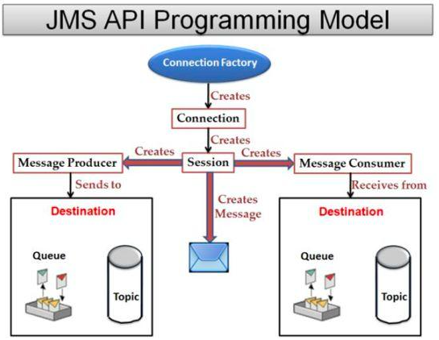
   
5. Spring MVC vs Java Server Faces (JSF)
    
    Проблема этого сравнения в том, что SpringMVC в качестве темплейтного движка обычно используется Thymeleaf или в более современном варианте — какой-либо Front-end движок (React, Angular & etc). В то время, как JSF — полноценное GUI решение с поддержкой AJAX из коробки и даже SPA приложений с помощью дополнительных библиотек, включая такие гиперудобные и красивые, как PrimeFaces и IceFaces.

    Примерчик из жизни:  
    И тут оказалось, что нативной поддержки AJAX в Spring MVC + Thymeleaf просто нет. Надо каждую операцию писать руками. А у нас практически каждый элемент требует AJAX поведения, причем в разных ситуациях — разного. И писать эту тонну JavaScript мои джаверы вообще не горят желанием. Ну что же. Скрепя сердце были вынуждены выкинуть весь написанный интерфейс и переделать все приложение на Angular (для чего взять еще и Front-end разработчика). И заняло это переписывание где-то больше месяца. Вот и считайте, в какие деньги вышло заказчику наше решение использовать стек Spring.
    
6. Spring Data vs JPA  

   Это единственный пункт, в котором Spring кроет как бык овцу стек Java EE. Spring Data — прекрасна, великолепна, быстра и удобна. Снимаю шляпу. Очень жаль, что аналога в Java EE стеке нет...
   
7. Spring Security vs JAAS

   Что хотел я сказать... Spring Security — фреймворк, который мне создал на моих проектах проблем больше, чем все остальные вместе взятые. Возможно, документация фиговая (это единственный Spring фреймворк с фиговой документацией). Возможно, сама тема сложная, но мои программисты традиционно мучаются с ней очень много. Полномасштабного использования JAAS у нас пока не было, но то, что простейшее — прилепляется легко.
   
   Отличия фреймворков вы понимаете и сами. JAAS, естественно, поддерживает распределенность.
   
8. Spring Boot vs Enterprise Server

   Все фанаты спрингового стека любят превозносить Spring Boot со словами «он прекрасен, с ним так все легко», забывая, что этот фреймворк — настоящие костыли, без которых связать воедино весь тот ад, который нафигачили ребята из проекта Spring просто очень сложно.
   
   Напоминаю, что аналогом Spring Boot для стека Java EE является просто любой Enterprise server. Там уже есть все нужные фреймворки нужных и консистентных версий, уже настроенные для работы друг с другом.
   

#### Java EE:

1. Java EE промышленности утверждены типовые основы API
2. Он преимущественно основан на аннотациях и CDI
3. JFC MVC framework для веб-разработки
4. JPA спецификация для обработки операции DB
5. JTA API с внедрением
6. EJB контейнерная и POJO основанная реализация
7. Oracle лицензия

#### Spring:

1. На основе IOC и AOP
2. На основе конфигурации XML (теперь они используют аннотацию)
3. Использует фреймворк Spring DAO (основанный на шаблоне дизайна шаблона) для подключения к базе данных
4. Предоставляет уровень абстракции для поддержки различных реализаций JTA.
5. Интегрируется с различными поставщиками Java для поддержки различных возможностей, таких как struts и т. д
6. Обеспечивает платформу end-to-end для построения веб-приложения, достигая свободной связи с использованием DI и AOP
7. Лицензия с открытым исходным кодом

## 11. Модули Spring. Архитектура Spring Runtime. Spring Security и Spring Data.

Spring потенциально может быть универсальным магазином для всех ваших корпоративных приложений. Однако Spring является модульным, позволяя вам выбирать, какие модули вам подходят, без необходимости вносить остальные. В следующем разделе приведены сведения обо всех модулях, доступных в Spring Framework.

#### Основной контейнер

Базовый контейнер состоит из модулей Core, Beans, Context и Expression Language, подробности которых следующие:

- Модуль Core обеспечивает основные части платформы, включая функции IoC и Dependency Injection.
- Модуль Bean предоставляет BeanFactory, которая представляет собой сложную реализацию фабричного шаблона.
- Модуль Context основан на прочной основе, предоставляемой модулями Core и Beans, и является средой для доступа к любым объектам, определенным и настроенным. Интерфейс ApplicationContext является координационным центром модуля Context.
- Модуль SpEL предоставляет мощный язык выражений для запросов и манипулирования графом объектов во время выполнения.

Уровень доступа к данным / интеграции состоит из модулей JDBC, ORM, OXM, JMS и Transaction, подробности которых следующие:

- Модуль JDBC предоставляет уровень абстракции JDBC, который устраняет необходимость в утомительном кодировании, связанном с JDBC.
- Модуль ORM предоставляет слои интеграции для популярных API объектно-реляционного отображения, включая JPA, JDO, Hibernate и iBatis.
- Модуль OXM предоставляет уровень абстракции, который поддерживает реализации отображения объектов / XML для JAXB, Castor, XMLBeans, JiBX и XStream.
- Модуль JMS Java Messaging Service содержит функции для создания и потребления сообщений.
- Модуль Transaction поддерживает программное и декларативное управление транзакциями для классов, которые реализуют специальные интерфейсы, и для всех ваших POJO.

Веб-слой состоит из модулей Web, Web-MVC, Web-Socket и Web-Portlet, подробности которых приведены ниже:

- Веб- модуль обеспечивает базовые функции веб-интеграции, такие как функция многоэтапной загрузки файлов и инициализация контейнера IoC с использованием прослушивателей сервлетов и контекста веб-ориентированного приложения.
- Модуль Web-MVC содержит реализацию Spring-Model-View-Controller (MVC) для веб-приложений.
- Модуль Web-Socket обеспечивает поддержку двусторонней связи на основе WebSocket между клиентом и сервером в веб-приложениях.
- Модуль Web- портлета предоставляет реализацию MVC для использования в среде портлета и отражает функциональность модуля Web-Servlet.

## 12. Реализация IoC и CDI в Spring. Сходства и отличия с Java EE.

### Описание работы IoC контейнера

Ниже представлена диаграмма, отражающая, как работает Spring. Ваши классы приложения совмещаются с метаданными конфигурации, в результате чего будет создан и инициализирован ApplicationContext, а на выходе вы получите полностью настроенное и готовое к выполнению приложение.

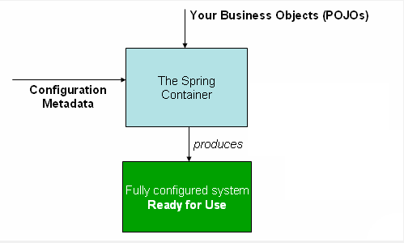

ApplicationContext представляет собой Spring IoC контейнер и необходим для инициализации, настройки и сборки бинов для построения приложения.

В метаданных конфигурации разработчик описывает как инициализировать, настроить IoC контейнер и собрать объекты в вашем приложении. В данном и других уроках этого цикла везде, где возможно, будет использоваться подход на основе аннотаций и Java-конфигурации. Если вы сторонник XML-конфигурации, либо хотите посмотреть как делать тоже самое через XML, обратитесь к оригинальной документации по Spring Framework или соответствующего модуля/проекта.

Основными признаками и частями Java-конфигурации IoC контейнера являются классы с аннотацией @Configuration и методы с аннотацией @Bean. Аннотация @Bean используется для указания того, что метод создает, настраивает и инициализирует новый объект, управляемый Spring IoC контейнером. Такие методы можно использовать как в классах с аннотацией @Configuration, так и в классах с аннотацией @Component(или её наследниках). Класс с аннотацией @Configuration говорит о том, что он является источником определения бинов. Самая простейшая из возможных конфигураций выглядит следующим образом:

```java
package lessons;

import org.springframework.context.annotation.Configuration;

/**
 * Конфигурационный класс Spring IoC контейнера
 */
@Configuration
public class LessonsConfiguration {
}
```
Для того, чтобы приступить к настройке и изучению Spring IoC контейнера, вы должны инициализировать ApplicationContext, который поможет также с разрешением зависимостей. Для обычной Java-конфигурации применяется AnnotationConfigApplicationContext, в качестве аргумента к которому передается класс, либо список классов с аннотацией @Configuration, либо с любой другой аннотацией JSR-330, в том числе и @Component

```java
public class Starter {

    private static final Logger logger = LogManager.getLogger(Starter.class);

    public static void main(String[] args) {
        logger.info("Starting configuration...");

        ApplicationContext context = new AnnotationConfigApplicationContext(LessonsConfiguration.class);
    }
}
```
```java
package lessons.services;

public interface GreetingService {
    String sayGreeting();
}
```
```java
package lessons.services;

public class GreetingServiceImpl implements GreetingService {

    @Override
    public String sayGreeting() {
        return "Greeting, user!";
    }
}
```

```java
@Configuration
public class LessonsConfiguration {
    @Bean
    GreetingService greetingService() {
        return new GreetingServiceImpl();
    }
}
```

```java
public class Starter {

    private static final Logger logger = LogManager.getLogger(Starter.class);

    public static void main(String[] args) {
        logger.info("Starting configuration...");

        ApplicationContext context = new AnnotationConfigApplicationContext(LessonsConfiguration.class);
        GreetingService greetingService = context.getBean(GreetingService.class);
        logger.info(greetingService.sayGreeting());  // "Greeting, user!"
    }
}
```

Полезная ссылка: https://spring-projects.ru/guides/lessons/lesson-2/

### Сходства и отличия с Java EE

Короче, пишу, как думаю я. 

Есть IoC - инверсия контроля (я завишу от кого-то, но не я буду его дергать (хотя это нужно мне), а кто-то "сверху" (контейнер (контекст)) будет поставлять мне то, от чего я хочу зависеть, таким образом достигается меньшая связанность, а => гибкость ).  
 
Ну и IoC это просто концепция (подход), а вот DI (в Spring) и CDI (в Java EE) - это реализации этого подхода. Да и прикол в том, что почти идентичные (по сути делают они одно и то же, но навзания аннотаций разные)   
Напоминание: Фактически в Java EE стеке изначально и использовался спринговый DI. Но после того как его включили прямо в Core, использовать его отдельно стало невозможно. Пришлось делать свой DI с аннотациями и программистками.

Но почему в Spring DI, а в Java EE CDI? Я могу предположить, что сязано это с тем, что для Java EE обязательно нужен Enterprise Application Server’a (Tomcat таким не является), поэтому Context всегда уже реализован в нем и содержится в этом сервере.

А что касается Spring, там используется DI, так как Context всегда реализуется самим програмистом (ApplicationContext)

Но, само собой, я могу ошибаться.


## 13. Реализация REST API в Java EE и Spring.


## 14. React JS. Архитектура и основные принципы разработки приложений.

### React JS
Начнем с того, что React - это JS библиотека(!!!). Обратите внимание, что именно
библиотека, а не фреймворк (отличаются инверсией управления), которая
предназначена для создания пользовательских интерфейсов. 

У него открытый исходный код. Если говорить о популярности, то у
реакта 160 тысяч звездочек. К примеру, у Ангуляра 68 тысяч.

На слайде есть картиночка вольного сравнения популярности Vue, Angular и
React с помощью гугл трендов. Реакт достаточно популярен сейчас, но это не в
коем случае не значит, что нужно использовать только реакт. Например, Angular
имеет более mvc - шную архитектуру, а у Vue гораздо субъективно меньше порог
вхождения.

Также React предназначен в основном для создания одностраничных
приложений или Single Page Application.

### SPA

#### SPA — подход, в котором:

- Используется один html-документ
- Динамическое обновление благодаря JavaScript
- Быстрый отклик
- Простота разработки
- Возможность работы в offline режиме

Что это вообще такое? Это такой подход к созданию веб-приложения, при
котором используется только один html-документ. Все нужные ресурсы
загружаются при первом запросе. Далее все взаимодействие осуществляется с
помощью javascript подгрузки необходимых частей данных.  
Ощутимое преимущество данного подхода - это достаточно высокая скорость
работы веб-приложения, что очень напоминает десктопное приложение так как
нет перезагрузок и подгрузки новых страниц. Благодаря этому можно создать
пользовательский интерфейс достаточно сложным, затратив минимальное
количество усилий.  
Также важной особенностью является возможность продолжения работы в offline
режиме благодаря кэшированию данных. Яркий пример, почему это хорошо -
допустим, листаете вы ленту в инстаграмме в метро и тут у вас пропадает
интернет, было бы круто, если при этом часть данных подгрузилась и вы смогли
бы еще какое-то время листать эту ленту

#### Минусы

- Долгая первая загрузка
- Нет поддержки javascript == нет приложения
- SEO
- Большая часть взаимодействия на клиенте

Но при этом у данного подхода есть определенные недостатки.
Самый очевидный из них - если в браузере отключена поддержка javascript, то
тут ничего не сделать кроме как просить пользователя включить его.  
Ну и конечно, первая загрузка у вас будет несколько дольше. Может вы
замечали когда-нибудь, что сайт сначала грузится очень долго, а потом
переходы на его другие страницы происходят достаточно быстро. Есть
вероятность, что скорее всего вы столкнулись с SPA приложением, которое
вначале просто загрузил все ему нужные скрипты, а дальше только
подхватывал нужные ему данные и встраивал в страницу.  
Также у SPA есть определенные проблемы с SEO в ввиду наличия только одной
html страницы.  
Так как большая часть взаимодействия с пользователем
переложена на SPA, то это влечет за собой некоторые проблемы с
безопасностью.

### Основные принципы разработки веб-приложения

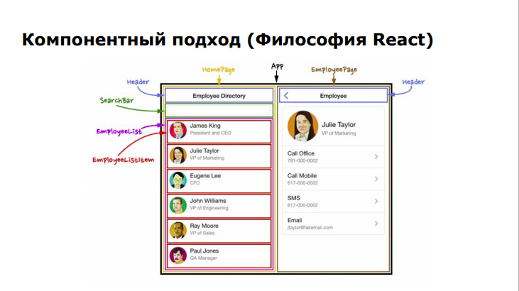

Начнем с того, что реакт основан на компонентах. Все ваше приложение
разделено на компоненты. Компонент - это некоторый инкапсулированный
элемент. На слайде есть пример интерфейса, разбитого на компоненты. Каждый
компонент предназначен для определенной цели. Например, отобразить имя,
аватарку и статус работника.  
И главное удобство заключается в том, что
компоненты можно переиспользовать - для того, чтобы показать список
работников, нам нужно взять шесть EmployeeListItem, а точнее использовать
один компонент и тот же компонент шесть раз, которому нужно сказать, какие
имя, статус и аватарку ему показывать. Это удобно, когда у вас в интерфейсе
много одинаковых элементов, которые вы не пишите каждый раз с нуля.  
Также здесь можно заметить свое дерево компонентов. В компоненте App
находятся HomePage и EmployeePage, дальше в HomePage лежит Header,
SearchBar и тд.

Это первая важная особенность React

### Архитектура приложения

#### VDOM

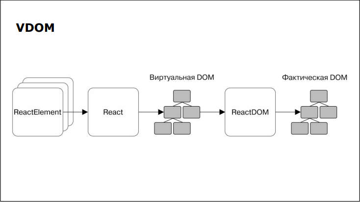

Cледующая - это Virtual DOM. DOM -
объектная модель документа. У реакта достаточно интересное взаимодействие
с DOM.  
Каждое изменение DOM - достаточно дорогостоящая операция. Поэтому
в реакте есть такая концепция как Virtual DOM. По сути изначально это полная
копия DOM. Однако, если вы взаимодействуете с каким-нибудь элементом,
реакт изменяет не реальный DOM, а только виртуальный. Далее он сравнивает
виртуальный дом с реальным - этот процесс называется сверкой или патчем и
происходит с помощью библиотеки ReactDOM - и если они различаются, то
реакт изменяет только ту часть DOMа, где он различается с виртуальным. в
каком-то смысле виртуальный дом - некоторая прослойка между вашим
приложением и DOM.

#### Как строит дерево React

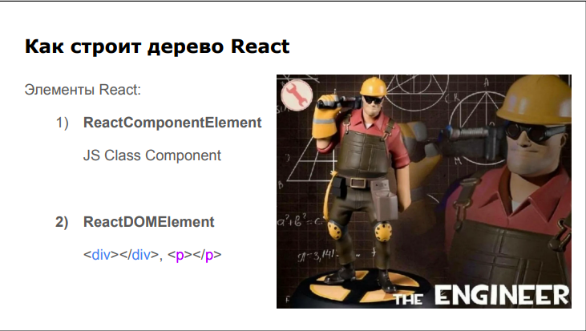

Есть два типа элементов - ReactComponentElement и ReactDOMElement.
- ReactComponentElement - ссылка на соответствующую функцию(класс) этого
компонента.
- ReactDOMElement - виртуальное представление DOM-элементов.


## 15. Компоненты React. State & props. "Умные" и "глупые" компоненты.

### Компоненты React 

Проще всего описывать компонент как функцию - пример функции. Однако
можно использовать и классы, но это достаточно устаревший подход. С точки
зрения React - оба подхода эквивалентны.

Чтобы отрендерить элемент используем функцию ReactDom.render(element,
document.getElementById(‘root’);
Clean Code:
Название компонента - всегда с большой буквы

```javascript
ReactDOM.render(
            <App/>,
    document.getElementById('root')
)
```

#### Жизненный цикл 

1. инициализация — создание экземпляра класса компонента
2. монтирование — компонент вставляется в DOM
3. обновление — компонент обновляется новыми данными через состояние или свойства
4. размонтирование — компонент удаляется из DOM

У всех компонентов в реакте есть жизненный цикл. Его важно понять и
осмыслить - это одно из основополагающих знаний хорошего реакт
разработчика. На начальном этапе, конечно, вам не нужно помнить абсолютно
все этапе, но основные - точно. Давайте их рассмотрим.

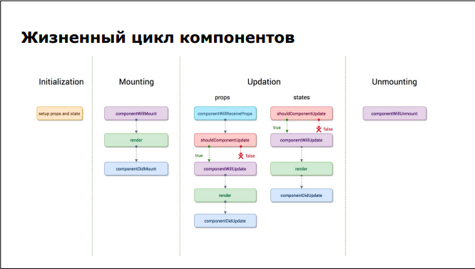

Updation:

shouldComponentUpdate - говорим, следует отрисовывать заново элемент или нет

props - componentWillReceiveProps - перед тем, как обновялются props, предыдущее состояние props'ов можно сохранить с помощью этой функции

Unmouting:

componentWillUnmount - что-то хотим сделать перед размонтированием (pop up открылся и нужно закрыть pop up и закрыть красиво и накинуть анимацию) 

### Props

```javascript
const EmployeeListItem = (props) =>
    <div>
        {props.name} - {props.status}
    </div>
);
```
```javascript
<EmployeeListItem name=”James King” status=”President and CEO”/>
```

Теперь нам нужно передать трем элементам разные фамилии и статус. Сделать мы это
можем через пропсы. Пропсы - это входные данные, которые мы передаем
функции - пример.  
Очень важное замечание - пропсы можно только читать. Другими словами, все
реакт компоненты должны вести себя как чистые функции. Это правило ни в
коем случае нельзя нарушать при написании React приложения.

### State

```javascript
const EmployeeListItem = (props) =>
    const [age, setAge] = useState(1) //Задается начальное состояние
        <div>
            {props.name} - {props.status}
            <br/>
            {age} //Будет выведено: 1
        </div>
);
```

Компонент может хранить в себе свое состояние и изменять его. В
функциональных компонентах для объявления переменной состояния
используется хук useState. Хук - это специальная функция, расширяющая
возможности функциональных компонентов. Хуки можно использовать только
внутри функциональных компонентов.  
Состояние компонента меняется только через предоставленную функцию, так
как реакт может сам заменить значение переменной, если вы изменяете ее
напрямую, а также он не будет в курсе сделанному вами изменению.   
Также в реакте данные передаются только в одном направлении - вы не
сможете обратиться к переменной родителя из ребенка. Единственный способ -
это сделать - передать в пропсы специальную функцию от родителя,
предоставляющую доступ к переменной.

### Events

```java
const EmployeeListItem = (props) =>
    const clickHandler = (e) => {console.log(e)}
    const [age, setAge] = useState(1) //Задается начальное состояние
        <div>
            <button onClick={clickHandler}>Click!</button>
            <br/>
            {age} //Будет выведено: 1
        </div>
     );
```

Работа с событиями - пример. e - синтетическое событие. Не нужно добавлять
addEventListener (привет jquery)

### Циклы

```javascript
const List = () =>
    <div>
        {[1,2,3].map((el,index)=><span key={index}>{el}</span>)}
    </div>
```

Работа с циклами в реакте аналогично обычному javascript - пример рендера
несколько элементов.

## 16. Разметка страниц в React-приложениях. JSX.

### React.createElement(...)

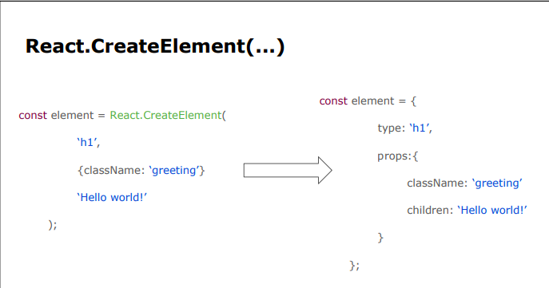

У реакта одна из главных функций - React.createElement(component, props,
children). С помощью нее можно создать элемент. Давайте посмотрим на
практике, как она работает:

На основе данной структуры реакт рекурсивно обходит дерево компонентов и
строит VDOM.

Естественно, описывать каждый элемент подобным способом - особый вид
извращения, это выглядит явно сложно читаемым, поэтому был придуман
синтаксический сахар - JSX.

### JSX

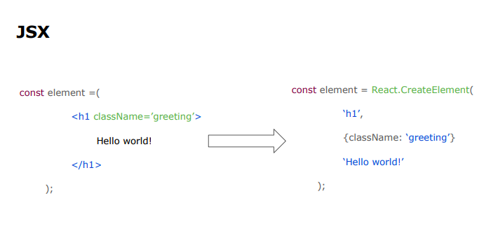

JSX - расширение Javascript, которое позволяет писать код, похожий на HTML.
Препроцессор JSX (К примеру, Babel), анализирует весь ваш код и преобразует
его в обычный javascript.


## 17. Навигация в React-приложениях. ReactRouter.

### React-router

React-router специально вынесен в отдельную библиотеку, потому что у нее есть опред свой функционал

Она позволяет реализовывать навигацию между компонентами  

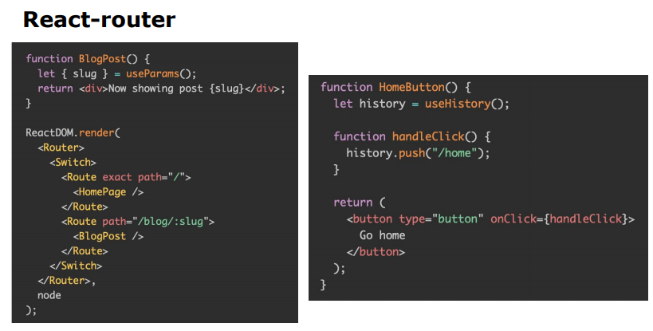

history - объект, сохраняющий историю и позволяющий вручную переходить на какие-нибудь компоненты


## 18. Управление состоянием интерфейса. Redux.

Redux - менеджер состояния. Чаще всего используется с React, но не
привязан к нему. 

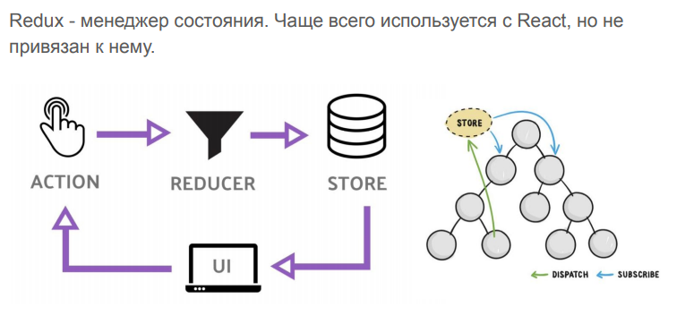

Redux - хранилище для всего нашего приложения и мы можем из любого компонента получить состояние переменной, который находится в общем хранилище и подписаться на ее изменение, либо кинуть экшен на ее изменение

### Важная особенность Redux:

Данные напрямую в store обновить НЕЛЬЗЯ  
Чтобы оновить данные, мы отправляем action  
Который кидает запрос на обработку какого типа был action  
И только потом изменяется значение в store 

### Особенности

- Общее, одно состояние данных, доступное из любого компонента
- Состояние изменяется только с помощью action, но не напрямую
- В компоненте можно подписаться на изменения определенного
значения
- Компоненты могут иметь свое состояние(state), но только если оно
важно только для данного компонента


… кода становится в несколько раз больше :(

### Store

Похож на state компонента, только он глобальный

Объект, который содержит состояние приложения и является
уникальным.

Является неизменяемым - обновляется путем создания нового объекта. (удаляем прошлое значение)

const store = createStore( initialState, reducer)

- getState()
- dispatch(action) - генерация события
- subscribe(listener) - подписка на изменения
- replaceReducer(nextReducer)

### Reducer

Чистая функция, которая вычисляет новое состояние.

Мы отправляем ей действие, проверяется тип действия

```javascript
function counterReducer(state = initialState, action) {
    if (action.type === 'counter/increment') {
        return {
            ...state,
            value: state.value + 1
        }
    }    
   
    return state
}
```

Возвращаем дефолтное состояние стейта, так как он проходит еще одну итерацию

### Action

Некоторое событие, которое должно привести к изменению состоянию.

С точки зрения js - это любой объект, имеющий идентификатор события
(type)

Action передается в reducer


```javascript
const addToDo = (name) => ({
    type: ‘ADD_TO_DO’,
    payload: { name }
})

```
### Dispatch

Функция redux, которая генерирует события.

dispatch(addToDo);

### Redux схема

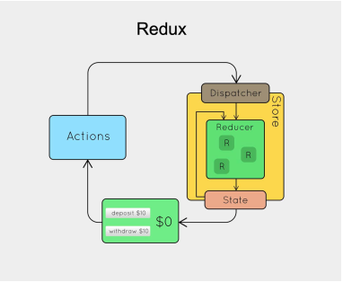

### Middleware

Усилители. Главная их суть - принять входные данные действия, обработать и отправить дальше. Часто используются для работы с api

Например, мы хотим, чтобы при клике на кнопку отправился запрос на сервер, после запроса на сервер в зависимости от ответа мы обновили состояние store.
Тут и используется middleware. Мы синхронно отправляем запрос, ожидаем ответа, в зависимости от ответа (состояния промиса) она вызывает опрделенный action 

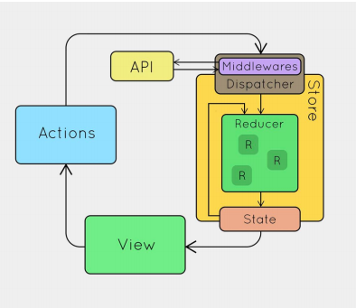

## 19. Angular: архитектура и основные принципы разработки приложений.

Angular - в отличие от react это фреймворк

В общем случае написан на TypeScript. За 4 года 9 релизов.

Angular - развитие библиотеки AngularJS. Т. е в 2016 году Angular=fork AngularJS. Дальше они развивались независимо

### Особенности Angular

Так как Angular -  это фреймворк, поэтому, чтобы начать разрабатывать приложение на нем, нужно сделать некую предварительную работу. Какую?

- Для разработки нужно настроить соборочное окружение (на базе node.js и npm). Ну и в этом окружении клиентскую часть нашего приложения собирать 
- Приложения состоят из модулей ( наследники класса NgModules) 
- Модули обеспечивают контекст для компонентов (components)
- Из компонентов строятся представления (views)
- Компоненты взаимодействуют с сервисами (элементы, реализующие логическую составляющую нашего фронта) (services) с помощью DI

### Архитектура приложения на базе Angular

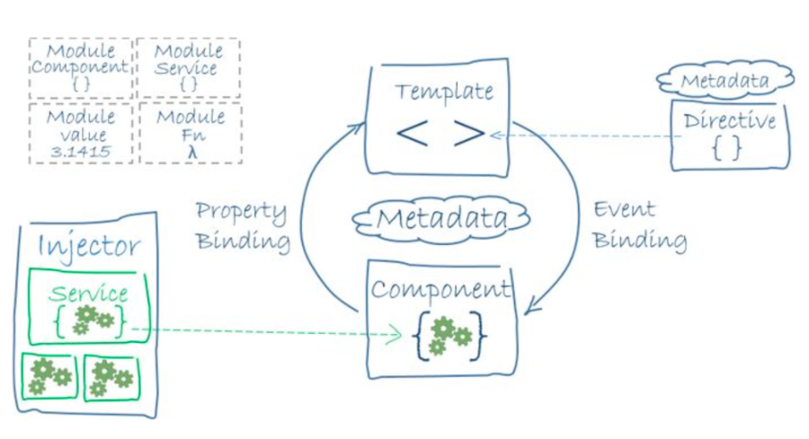

- Шаблон и комонент циклически обмениваются (путем биндинга пропертей и событий)
- В компонент встраиваются сервисы путем использования Injector'a (он отвечает за DI в Angular)
- Template (шаблон) использует метаданные заданной директивы, связывая себя с пропертями.

## 20. Angular: модули, компоненты, сервисы и DI.

### Модули

- Не совсем то же самое, что модули в ES6 (хотя и похожи)
- Каждый модуль обеспечивает контекст компиляции для одного или группы компонентов
- Модули могут связывать компоненты с сервисами, необходимыми для работы этих компонентов
- Группировка компонентов по модулям - на усмотрение программиста 
- Каждое приложение обязательно включает в себя корневой модуль (root module) под названием AppModule (файл app.module.ts)
- Модули могут ссылаться друг на друга (возможны импорт и экспорт модулей)
- Могут быть использованы для реализации ленивой загрузки (загрузка по требованию) lazy loading

#### Структура модуля

- Каждый модуль - класс TS с декоратором @NgModule() (декоратор - подобие аннотации)
- Содержит секции
    - declarations - компоненты, директивы, фильтры, содержащиеся в этом модуле
    - exports - то, что объявлено в этой секции, будет видно и доступно для использования в других модулях
    - imports - список внешних модулей, содержимое секции exports которых используется в текущем модуле
    - providers - сервисы, реализованные в этом модуле, видимые в глобальном контексте приложения
    - bootstrap - главное предсталвение приложения (объявляется только в корневом модуле). С него начинается рендеринг интерфейса приложения
    
#### Пример модуля

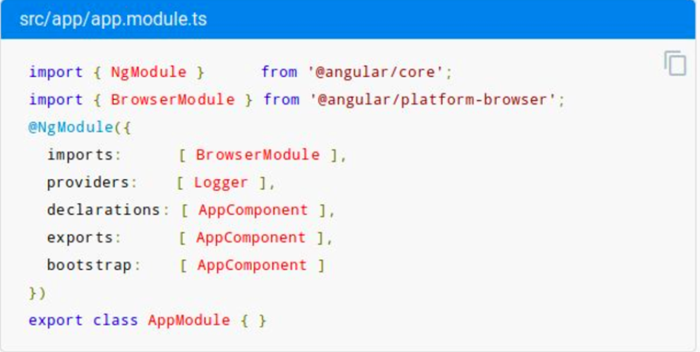


### Компоненты 

- У всех компонентов внутри одного модуля общий _контекст компиляции_. При компиляции они друг друга видят и компилятор видит все компоненты этого модуля
- Каждый компонент - отдельный класс
- Контролирует область экрана, называемую представлением (div-чик или блок)
- Ангуляр управляет жизненным циклом компонентов


 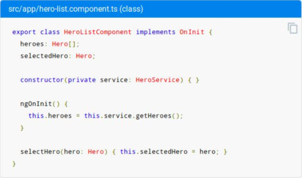

### Представления (views)

- Компоненты и их шаблоны (templates) формируют представления (views)
- Комонент может содержать иерархию представлений (view hierarchy)
- Каждый компонент содержит корневое представление, с которого начинается рендеринг интерфейса (host view)
 
### Метаданные компонента

- Задаются с помощью декоратора @Component
- Сообщает рантайму о том, что это за компонент и где искать его составляющие

 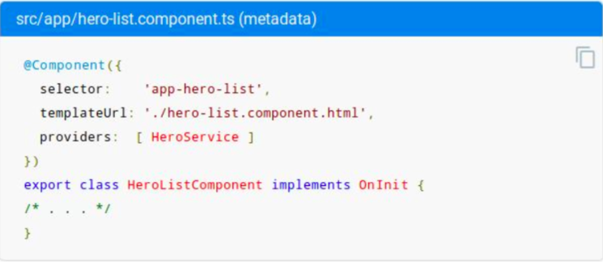

### Фильтры

 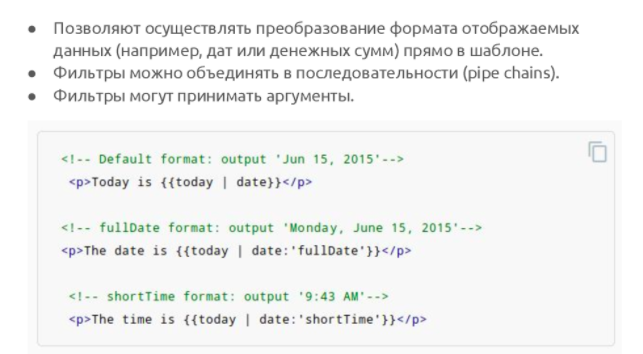

### Директивы

 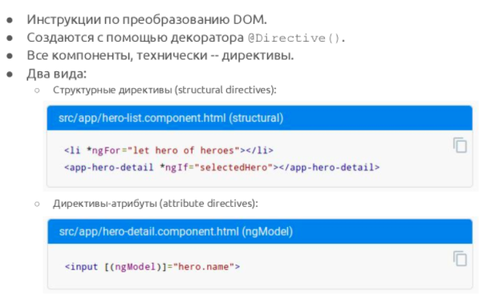

### Сервисы и DI

- Сервисы (services) реализуют какие-либо действия, не формируя представление (логика средствами сервиса не отражается на интерфейс, потом она как-то в интерфейсе может отразиться, но не прямым путем)
- Реализуются в виде отдельых классов в соответствии с принципами ООП
- Компонент может делигировать какие-либо из своих задач сервисам 
- Доступ компонентов к сервисам реализуется с помощью DI

 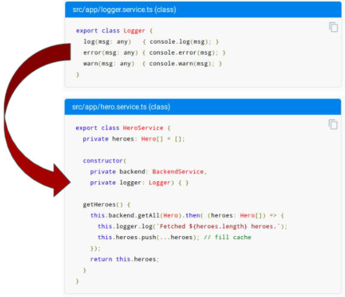

### DI - осуществляется элементом Angular Injector' ом

- Компоненты могут использовать сервисы с помощью DI
- Для того, чтобы класс можно было использовать с помощью DI, он должен содержать декоратор @Injectable()

#### Основные принципы реализации DI

- Приложение содержит как минимум один глобальный Injector, который занимается DI (Injector'ов может быть >1)
- Injector создает зависимости и передает их экземпляры контейнеру (container)
- Провайдер (provider) - это объект, который сообщает Injector'у, как получить или создать экземпляр зависимости
- Обычно провайдером сервиса является сам его класс 
- Зависимости компонентов указываются в качестве параметров их конструкторов 

#### Провайдеры для сервисов

 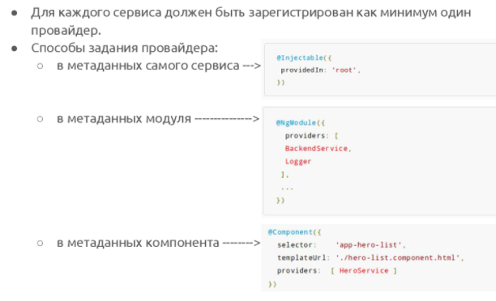


## 21. Angular: шаблоны страниц, жизненный цикл компонентов, подключение CSS.

### Шаблоны и представления

- Представление (view) компонента задается с помощью шаблона (template) - та самая разметка, которая будет сформирована при просмотре компонента (в браузере)
- Представления часто группируются иерархически (складываются друг в друга)
- Компонент может содержать иерархию представлений (view hierarchy), которая содержит встроенные представление (embedded views) из других компонентов

#### Синтаксис шаблонов

- Похож на обычный HTML 
- Взаимодействие с классом компонента осуществляется с помощью ссылок на его свойства (data binding) {{hero.name}}
- Также можно использовать фильтры (pipes) и директивы (directives) 

 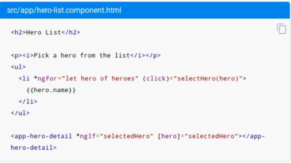

#### Связь

Связь между шаблоном и компонетом работает в обе стороны:
- Шаблон(реализация компонента) отображает данные с компонента через property binding ({{hero.name}})
- Компонент принимает данные шаблона через event binding ((click) = "selectHero(hero)")

#### Три вида связи

 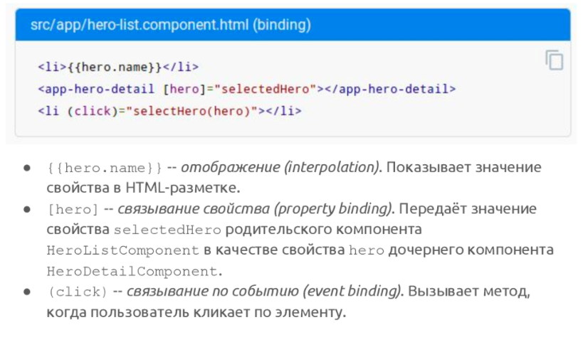


## 22. Angular: клиент-серверное взаимодействие, создание, отправка и валидация данных форм.

### Взаимодействие с back-end'ом

 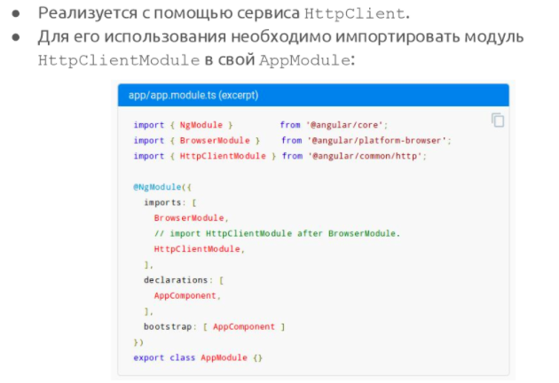

### Использование HttpClient

 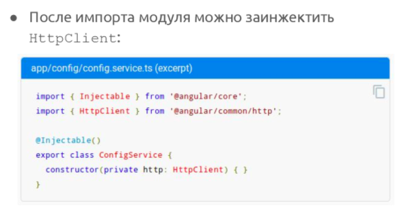

### Пример получения JSON с сервера 

 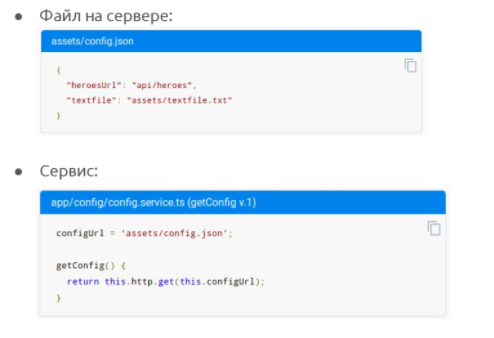

 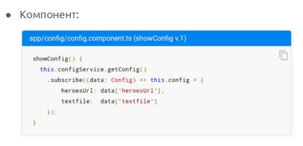


## Концепция Single Page Application

### SPA

Одностраничное приложение — это веб-приложение или веб-сайт, использующий единственный HTML-документ как оболочку для всех веб-страниц и организующий взаимодействие с пользователем через динамически подгружаемые HTML, CSS, JavaScript, обычно посредством AJAX

Single Page Application – сокращенно SPA, в переводе на русский язык означает “Приложение одной страницы”. Другими словами SPA – это web-приложение, размещенное на одной web-странице, которая для обеспечения работы загружает весь необходимый код вместе с загрузкой самой страницы. Приложение такого типа появились сравнительно недавно, с началом эры HTML5 и SPA является типичным представителем приложений на HTML5.

Получается немного скомкано: “Одна страница.. другая станица, третья страница… одностраничный портал”. Расставим все точки над “Ё”. Страница сайта, на котором размещены все ссылки на все CSS, и ссылки на скрипты, необходимые для работы SPA мы назовем “Web-страница”. Файл с такой странице обычно называется “index.html” (в ASP.NET MVC может быть index.cshtml или index.vbhtml или даже index.aspx) А страницы, которые переключает пользователь внутри одностраничного портала назовем “модули”.

#### Плюсы

1) Приложения на SPA отлично работают на устройствах как стационарных, так и мобильных. “Большие” компьютеры, планшеты, смартфоны, и, в конце-концов, простые телефоны (некоторые) могут беспрепятственно работать с сайтами построенных по принципу SPA. Итак, первый “плюс” – работа на большом количестве устройств, а значит, создав одно приложение, вы получаете гораздо большую аудиторию пользователей нежели при использовании стандартного подхода.
(Создать мобильное приложение проще, потому что разработчик может повторно использовать один и тот же внутренний код для веб-приложения и собственного мобильного приложения.)

2) Богатый пользовательский интерфейс, так называемый User Experience. Так как web-страница одна, построить богатый, насыщенный пользовательский интерфейс гораздо проще. Проще хранить информацию о сеансе, управлять состояниями представлений (views) и управлять анимацией (в некоторых случаях).

3) SPA существенно (в разы) сокращает так называемые “хождения по кругу”, то есть загрузку одного и того же контента снова и снова. Если ваш портал (сайт) использует шаблон, то вместе с основным содержанием какой-либо страницы посетитель сайта обязательно загружает разметку шаблона. Да, кэширование данных на данном этапе развития WWW достигло высочайших результатов, но если нечего кэшировать, то и время, и ресурсы на это не тратятся.

4) SPA работает быстро, поскольку большинство ресурсов (HTML + CSS + Scripts) загружаются только один раз за время существования приложения. Только данные передаются туда и обратно.

5) Кэширование данных — приложение отправляет всего один запрос, собирает данные, а после этого может функционировать в offline-режиме.

#### Минусы

1) Плохая SEO оптимизация. SPA работает на основе javascript и загружает информацию по запросу со стороны клиента. Поисковые системы с трудом могут имитировать данное поведение. Потому большинство страниц попросту недоступны для сканирования поисковыми ботами, поэтому продвижение сайта в 2020 может быть усложнено.

2) Неактивный javascript. Некоторые пользователи отключают javascript в своих браузерах, а без него ваше приложение не будет работать.

3) Низкий уровень безопасности. (По сравнению с «традиционным» приложением, SPA менее безопасен. Благодаря межсайтовому скриптингу (XSS) злоумышленники могут внедрять клиентские скрипты в веб-приложение другими пользователями.)

Принципы любого фреймворка (о них поговорим позже), который реализует парадигму SPA должны придерживаться следующих понятий и определений:

- SPA поддерживает клиентскую навигации. Все “хождения” пользователя по модулям-страницам однозначно фиксируются в истории навигации, причем навигация при этом является “глубокой”, то есть если пользователь скопирует и откроет ссылку на внутреннюю модуль-страницу в другом браузере или окне, он попадет на соответствующую страницу.
- SPA размещается на одной web-странице, значит всё необходимое для работы сайта (портала) скрипты и стили должны быть определены в одном месте проекта – на единственной web-странице.
- SPA хранит постоянно состояние (важные переменные) работы клиента (клиентского скрипта) в кэше браузера или в Web Storage.
- SPA загружает все скрипты требующиеся для старта приложения при инициализации web-страницы.
- SPA постепенно подгружает модули по требованию.

### MPA

Многостраничные приложения имеют более классическую архитектуру. Каждая страница отправляет запрос на сервер и полностью обновляет все данные. Даже если эти данные небольшие. Таким образом тратится производительность на отображение одних и тех же элементов. Соответственно это влияет на скорость и производительность.

#### Плюсы 

1) Легкая SEO оптимизация. Архитектура MPA позволяет достаточно легко оптимизировать каждую страницу под поисковые системы.

2) Легкая разработка. Как правило для разработки многостраничного приложения требуется меньший стек технологий.

3) Это идеальный подход для пользователей, которым нужна наглядная карта того, куда идти в приложении. Прочная, многоуровневая навигация по меню - неотъемлемая часть традиционного многостраничного приложения.

4) Множество решений.

#### Минусы

1) Для разработки мобильных приложений потребуется намного больше времени. В большинстве случаев потребуется написание back-end с нуля.

2) Сложно разделить front-end и back-end. Как правило они очень тесно взаимодействуют друг с другом. Усложняется работа front-end и back-end разработчиков.

3) Развитие становится довольно сложным. Разработчик должен использовать фреймворки как на стороне клиента, так и на стороне сервера. Это приводит к увеличению времени разработки приложения.

### Наглядные примеры 

__MPA__. Возьмём среднестатистический сайт, например, воображаемый интернет-магазин плюшевых игрушек MimimiShop. Вы заходите на главную страницу mimimi-shop.ru и видите много-много карточек с мягкими мишками. Чтобы вы смогли их увидеть, браузер послал запрос на сервер и получил файл index.php.

Один мишка очень вам нравится, и вы по нему кликаете. Ссылка меняется на mimimi-shop.ru/teddy-bears/92, страница перезагружается, браузер получает другой файл – product.php. Здесь совершенно другая информация – мишка только один, зато подробно описан.

В классическом Multi Page Application каждый url – это отдельный запрос к серверу с получением нового шаблона.

__SPA__. Перепишем MimimiShop как SPA. Вы заходите на главную страницу mimimi-shop.ru, и браузер загружает всего один файл index.html и большой скрипт mimimi.spa.js. После загрузки скрипт выводит на страницу компонент каталога – множество карточек с мягкими игрушками. Когда вы кликаете на понравившегося мишку, компонент каталога реактивно заменяется на компонент одного товара. Страница при этом не перезагружается, всё происходит красиво и плавно.

В итоге браузер отдал только одну страницу – index.html.

Требования к маршрутизации SPA:

- Переход между страницами должен происходить без перезагрузки.
- Каждый переход должен сохраняться в истории браузера (кнопки Назад/Вперед должны функционировать).
- При вводе в адресную строку некоторого маршрута должен выводиться тот контент, который этому маршруту соответствует, как в мультистраничном приложении.

### Выводы 

Каждая архитектура имеет свои преимущества и недостатки и хорошо подходит для определенного типа проекта. SPA отличается своей скорость и возможностью на базе готового кода разработать мобильное приложение. Но в тоже время, SPA имеет плохую SEO оптимизацию. Таким образом данная архитектура отлично подход для SaaS платформ, социальных сетей, закрытых сообществ, где поисковая оптимизация не имеет значения.

MPA больше подходит для создания крупных интернет магазинов, бизнес сайтов, каталогов, маркетплейсов и т.п. Хорошо оптимизированная MPA имеет высокую скорость и производительность, но все же не позволяет легко разработать мобильное приложение. MPA и SPA с правильной архитектурой хорошо подходят для разработки масштабируемых веб приложений.

## Вопросы к себе

1) Зачем export default в файлах js
2) Отличие react-router от react-router-dom
3) When using Webpack you need to require images in order for Webpack to process them, which would explain why external images load while internal do not, so instead of  you need to use  replacing image-name.png with the correct image name for each of them. That way Webpack is able to process and replace the source img.
4) rest easy что це такое
5) Лучше деплоить вместе или раздельно 
6) Отличие Spring от JavaEE тщательнее
7) Как связаны JNDI c IoC, CDI, Location Transparency 
8) Middleware who is it (thunk)
9) 12 вопрос
10) принцип работы redux (dispatch, reducer, store, actions)

Концепция Single Page Application

- конспект видео про Spring (2 часа)
- конспект семинара с Цопой 
- 12 вопрос