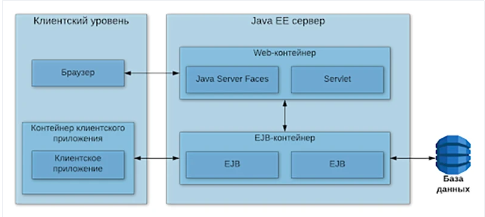

# Laba4_WEB

Будет больно, но ради этого и живем

- [ ] Уровень back-end должен быть основан на JavaEE (необходимо использовать EJB)
- [ ] Уровень front-end должен быть построен на React + Redux (необходимо использовать ES6 и JSX) с использованием набора компонентов React Toolbox
- [ ] Взаимодействие между уровнями back-end и front-end должно быть организовано посредством REST API

Приложение включает в себя две страницы: стартовую и основную. Обе страницы должны быть адаптированы для отображения в 3 режимах:
- [ ] "Десктопный" - для устройств, ширина экрана которых равна или превышает 1169 пикселей 
- [ ] "Планшетный" - для устройств, ширина экрана которых равна или превышает 708, но меньше 1169 пикселей 
- [ ] "Мобильный" - для устройств, ширина экрана которых меньше 708 пикселей 
    
Стартовая страница должна содержать следующие элементы:
- [x] "Шапку", содержащую ФИО студента, номер группы и номер варианта
- [x] Форму для ввода логина и пароля 
- [x] Информация о зарегистрированных в системе пользователях должна храниться в отдельной таблице БД 
- [x] Пароль должен храниться в виде хэш-суммы
- [x] Доступ неавторизованных пользователей к основной странице приложения должен быть запрещен 

Основная страница приложения должна содержать следующие элементы:
- [x] Набор полей ввода для задания координат точки и радиуса области в соответствии с вариантом задания:
    - [x] Dropdown {'-4','-3','-2','-1','0','1','2','3','4'} для координаты по оси X
    - [x] Input (-3 ... 5) для координаты по оси Y
    - [x] Dropdown {'-4','-3','-2','-1','0','1','2','3','4'} для задания радиуса области 
- [x] Если поле ввода допускает ввод заведомо некорректных данных (таких, например, как буквы в координатах точки или отрицательный радиус), то приложение должно осуществлять их валидацию 
- [x] Динамически обновляемую картинку, изображающую область на координатной плоскости в соответсвии с номером варианта и точки, координаты которых были заданы пользователем.
- [x] Клик по картинке должен инициировать сценарий, осуществляющий определение координат новой точки и отправку их на сервер для проверки ее попадания в область. 
- [x] Цвет точек должен зависить от факта попадания/непопадания в область
- [x] Смена радиуса также должна инициировать перерисовку картинки
- [x] Таблицу со списком результатов предыдущих проверок
- [ ] Ссылку, по которой аутентифицированный пользователь может закрыть свою сессию и вернуться на стартовую страницу приложения
 
Дополнительные требования к приложению:

- [x] Все результаты проверки должны сохраняться в базе данных под управлением СУБД PostgreSQL 
- [x] Для доступа к БД необходимо использовать JPA

# Вопросы к защите лабораторной работы

## 1. Платформа Java EE. Спецификации и их реализации.

Java EE — это платформа, построенная на основе Java SE, которая предоставляет API и среду времени выполнения для разработки и запуска крупномасштабных, многоуровневых, масштабируемых, надежных и безопасных сетевых приложений.

Подобные приложения называют корпоративными (Enterprise applications), так как они решают проблемы, с которыми сталкиваются большие бизнесы. 

Java EE представляет из себя набор спецификаций и документации, описывающий архитектуру серверной платформы для задач средних и крупных предприятий.
Сервер приложений Java EE (часто называемый контейнером) — это реализация системы в соответствии со спецификацией, обеспечивающая работу модулей с логикой конкретного приложения.

Деление на платформы (Java SE, Java EE, Java Card ...) появилось в Java EE 6 и позволяет сделать более «лёгкими» приложения, которым не нужен полный стек технологий Java EE. Существует только 2 профиля — Full и Web. 	Сервер приложений может реализовывать спецификации не всей платформы, а конкретного профиля.

###Отличие Spring от JavaEE

Конкурентном Java EE считается Spring Framework. Если взглянуть на развитие двух данных платформ, выходит интересная картина. Первые версии Java EE были созданы при участии IBM. Они вышли крутыми, но неповоротливыми, тяжеловесными, неудобными в использовании. Разработчики плевались из-за необходимости поддерживать большое количество конфигурационных файлов и из-за прочих причин, усложняющих разработку.

В то же время на свет появился Spring IoC. Это была маленькая, красивая и приятная в обращении библиотека. В ней также использовался конфигурационный файл, но в отличии от Java EE, он был один. Простота Spring привела к тому, что практически все стали использовать данный фреймворк в своих проектах. 

А далее Spring и Java EE начали свой путь к одному и тому же, но с разных концов. Компания Pivotal Software, разработчик Spring, стали выпускать проект за проектом, чтобы покрыть все возможные и невозможные потребности Java-разработчиков. Постепенно то, что раньше называлось Spring, сначала стало одним из проектов, а потом и вовсе слилось с несколькими другими проектами в Spring Core. Все это привело к неминуемому усложнению Spring по сравнению с тем, каким он был изначально. Со временем следить за всем клубком зависимостей спринга стало уж совсем сложно, и возникла потребность в отдельной библиотеке, которая стала бы загружать и запускать все сама (сейчас где-то икнул так горячо любимый Spring Boot).

Все это время JCP работал над одним — добиться максимального упрощения всего, что только можно внутри Java EE. В итоге в современном EJB для описания бина достаточно указать одну аннотацию над классом, что предоставляет разработчику доступ ко всей мощи технологии Enterprise Java Beans. И подобные упрощения затронули каждую спецификацию внутри Java EE. 

В итоге по функционалу Spring и Java EE примерно разделяют паритет. Где-то что-то лучше, где-то что-то хуже, но если смотреть глобально, больших различий нет. То же самое касается сложности работы. И Spring, и Java EE являются превосходными инструментами. Пожалуй, лучшими из того, что сейчас есть, для построения корпоративных сетевых приложений на языке Java. 

!! Однако, Java EE может работать в общем случае только в рамках Enterprise Application Server’a (Tomcat таковым не является), а приложение на Spring стеке может работать на чем угодно (на том же Tomcat), и даже вообще без сервера (так как запустит его внутри себя самостоятельно).

!! Это делает Spring идеальным инструментом для разработки небольших приложений с GUI на Front-end или для микросервисной архитектуры. Но отказ от зависимости от серверов приложений отрицательно сказался на масштабируемости Spring-приложений.

А Java EE хорошо подходит для реализации масштабируемого монолитного кластерного приложения.


Пример Web profile: Tomcat

Пример Full profile: Glassfish

### Основные концепции

- Приложения строятся из компонентов, работающих под управлением контейнеров.
- Используются следующие принципы:
    - Inversion of Control (IoC) + Contexts & Dependency Injection (CDI).
    - Location Transparency.

https://javarush.ru/groups/posts/2637-vvedenie-v-java-ee - классное объяснение 


## 2. Принципы IoC, CDI и Location Transpanency. Компоненты и контейнеры.

Есть такая штука - JNDI - набор API, позволяющий доставать объекты из контейнера по их именам. По сути, это замена обращению по ссылкам, и благодаря этому легко реализуется Dependency Lookup и Dependency Injection. Хранение объектов в таком случае можно представить как Map, где ключи - это имена, а значения - нужные объекты (например, ссылки на них).

#### Два варианта использования JNDI:

- CDI (аннотации) — работает только в managed компонентах. 
- Прямой вызов API — работает везде.

```java
// Пример получения ссылки на JDBC datasource. DataSource dataSource = null;
public class JNDI { 

public void jndi() {
  try {
   // Инициализируем контекст по умолчанию. 
   Context context = new InitialContext(); 
   dataSource = (DataSource) context.lookup("Database"); 
  } catch (NamingException e) {
    // Ссылка не найдена
  }
}


}
```

### IoC - Inversion of Control (применительно к Java EE):
- Жизненным циклом компонента управляет контейнер (а не программист).
- Объекты создает не программист (используя new), а контейнер IoC. Применяется далеко не ко всем объектам в приложении, а только к  управляемым (в Spring это классы с аннотациями @Component, @Service и т.д., в EJB — бобы @Stateless, @Stateful, @MessageDriven).
- За взаимодействие между компонентами отвечает тоже контейнер.

### CDI — Contexts and Dependency Injection (позволяет снизить (или совсем убрать) зависимость компонента от контейнера):
как бы компонент и так зависит от контейнера, так как тот его порождает, но тут о другом: __программист, когда пишет компонент, он не зависит от API, предоставляемых контейнером__

- Не требуется реализации каких-либо интерфейсов. 
- Не нужны прямые вызовы API.
- Реализуется через аннотации.

Пример CDI (JSF Managed Bean):

```java
@ManagedBean(name="message")
@SessionScoped
public class MessageBean implements Serializable {
   //business logic and whatever methods
}


@ManagedBean
@SessionScoped
public class HelloBean implements Serializable {

   @ManagedProperty(value="#{message}") //ЭТО И ЕСТЬ CDI
   private MessageBean messageBean;

   //must povide the setter method
   public void setMessageBean(MessageBean messageBean) {
this.messageBean = messageBean; }
}
```
#### Еще одна интерпретация CDI

Вместо построения зависимостей в компоненте, где они нужны:

```java
public class Something {
  private Dependency dependency = new Dependency();
}
```
Мы принимаем их извне, что избавляет компонент от необходимости управлять ими:

```java
public class Something {
  private Dependency dependency;

  public Something (Dependency dependency) {
    this.dependency = dependency;
  }
} 
```
Чтобы нам не пришлось вручную собирать все зависимости для создания компонентов, контейнер IoC предоставляет возможность внедрения инстанций в поля, помеченные специальной аннотацией:
```java
public class SomethingDI {
  @Autowired private Dependency dependency; // Spring
  @EJB private EjbDependency ejbDependency; // EJB
}
```


### Location Transparency - прозрачность местонахождения - это что-то вроде паттерна

Инфраструктура завязана на RMI (Java API, позволяющий вызывать методы удаленных объектов)

Благодаря CDI не важно, где физически расположен вызываемый компонент — за его вызов отвечает контейнер.

Клиент имеет прокси, обращается с ней как с нужным объектом. Прокси перенаправляет его вызовы куда следует: если нужный компонент находится локально, идёт к нему обращение по ссылке; если удалённо (в другой JVM) - необходима сериализация передаваемых данных.

### Компоненты и контейнеры

Приложение состоит из компонентов и контейнера, управляющего жизненным циклом компонентов. Пример: Servlet - компонент, Glassfish - контейнер.

Голая Java EE — это просто набор спецификаций. 

Данные спецификации реализуют различные Java EE сервера.

Java EE сервер — это серверное приложение, которое реализует API-интерфейсы платформы Java EE и предоставляет стандартные службы Java EE. Серверы Java EE иногда называют серверами приложений. Данные сервера могут содержать в себе компоненты приложения, каждый из которых соответствует своему уровню в многоуровневой иерархии. Сервер Java EE предоставляет этим компонентам различные сервисы в форме контейнера.

Контейнеры — это интерфейс между размещенными на них компонентами и низкоуровневыми платформо-независимыми функциональными возможностями, поддерживающими компонент.  

Контейнеры предоставляют размещенным на них компонентам определенные службы. Например, управление жизненным циклом разработки, внедрение зависимости, параллельный доступ и т. д. Контейнеры скрывают техническую сложность и повышают мобильность.

#### В Java EE существует четыре различные типа контейнеров:

- Контейнеры апплетов выполняются большинством браузеров. При разработке апплетов можно сконцентрироваться на визуальной стороне приложения, в то время как контейнер обеспечивает безопасную среду.
- Контейнер клиентского приложения (ACC) включает набор Java-классов, библиотек и других файлов, необходимых для реализации в приложениях Java SE таких возможностей, как внедрение, управление безопасностью и служба именования.
- Веб-контейнер предоставляет базовые службы для управления и исполнения веб-компонентов (сервлетов, компонентов EJB Lite, страниц JSP, фильтров, слушателей, страниц JSF и веб-служб). Он отвечает за создание экземпляров, инициализацию и вызов сервлетов, а также поддержку протоколов HTTP и HTTPS. Этот контейнер используется для подачи веб-страниц к клиент-браузерам.
- EJB (Enterprise Java Bean) контейнер отвечает за управление и исполнение компонентов модели EJB, содержащих уровень бизнес-логики приложения. Он создает новые сущности компонентов EJB, управляет их жизненным циклом и обеспечивает реализацию таких сервисов, как транзакция, безопасность, параллельный доступ, распределение, служба именования либо возможность асинхронного вызова. 

#### Также в Java EE выделяют четыре типа компонентов, которые должна поддерживать реализация Java EE спецификации:

- Апплеты — это приложения из графического пользовательского интерфейса (GUI), выполняемые в браузере. Они задействуют насыщенный интерфейс Swing API для производства мощных пользовательских интерфейсов.
- Приложениями называются программы, выполняемые на клиентской стороне. Как правило, они относятся к графическому пользовательскому интерфейсу (GUI) и применяются для пакетной обработки.
- Веб-приложения (состоят из сервлетов и их фильтров, слушателей веб-событий, страниц JSP и JSF) — выполняются в веб-контейнере и отвечают на запросы HTTP от веб-клиентов. Сервлеты также поддерживают конечные точки веб-служб SOAP и RESTful.
- Корпоративные приложения (созданные с помощью технологии Enterprise Java Beans, службы сообщений Java Message Service, интерфейса Java API для транзакций, асинхронных вызовов, службы времени) выполняются в контейнере EJB. Управляемые контейнером компоненты EJB служат для обработки транзакционной бизнес-логики. Доступ к ним может быть как локальным, так и удаленным по протоколу RMI (или HTTP для веб-служб SOAP и RESTful).



## 3. Управление жизненным циклом компонентов. Дескрипторы развёртывания.

По большей части, жизненным циклом компонентов управляет контейнер. Тем не менее, есть возможность влиять на этот процесс с помощью аннотаций / xml / прочих файлов настроек. Дескрипторы - это как раз такие файлы (в том числе xml). В них можно задавать свойства используемых в приложении компонентов: имена, ссылки, параметры. Также можно настраивать то, как итоговое приложение будет собираться и как оно будет взаимодействовать с внешним миром.

Дескриптор развёртывания - конфигурационный файл артефакта. Дескриптор развёртывания описывает то, как компонент, модуль или приложение (такое, как веб-приложение или приложение предприятия) должно быть развёрнуто

Примеры дескрипторов развёртывания:
- web.xml - дескриптор развёртывания веб-приложений (упаковываемых обычно в .war архивы)
- ejb-jar.xml - дескриптор развёртывания EJB-приложения	
- application.xml - дескриптор развёртывания приложения, использующего несколько web.xml / ejb-jar.xml


## 4. Java EE API. Виды компонентов. Профили платформы Java EE.
## 5. Компоненты EJB. Stateless & Stateful Session Beans. EJB Lite и EJB Full.
## 6. Работа с электронной почтой в Java EE. JavaMail API.
## 7. JMS. Реализация очередей сообщений. Способы доставки сообщений до клиента. Message-Driven Beans.
## 8. Понятие транзакции. Управление транзакциями в Java EE. JTA.
## 9. Веб-сервисы. Технологии JAX-RS и JAX-WS.
## 10. Платформа Spring. Сходства и отличия с Java EE.
## 11. Модули Spring. Архитектура Spring Runtime. Spring Security и Spring Data.
## 12. Реализация IoC и CDI в Spring. Сходства и отличия с Java EE.
## 13. Реализация REST API в Java EE и Spring.
## 14. React JS. Архитектура и основные принципы разработки приложений.
## 15. Компоненты React. State & props. "Умные" и "глупые" компоненты.
## 16. Разметка страниц в React-приложениях. JSX.
## 17. Навигация в React-приложениях. ReactRouter.
## 18. Управление состоянием интерфейса. Redux.
## 19. Angular: архитектура и основные принципы разработки приложений.
## 20. Angular: модули, компоненты, сервисы и DI.
## 21. Angular: шаблоны страниц, жизненный цикл компонентов, подключение CSS.
## 22. Angular: клиент-серверное взаимодействие, создание, отправка и валидация данных форм.

## Вопросы к себе

1) Зачем export default в файлах js
2) Отличие react-router от react-router-dom
3) When using Webpack you need to require images in order for Webpack to process them, which would explain why external images load while internal do not, so instead of  you need to use  replacing image-name.png with the correct image name for each of them. That way Webpack is able to process and replace the source img.
4) rest easy что це такое
5) Лучше деплоить вместе или раздельно 
6) Отличие Spring от JavaEE тщательнее
7) Как связаны JNDI c IoC, CDI, Location Transparency 
8) Middleware who is it (thunk)